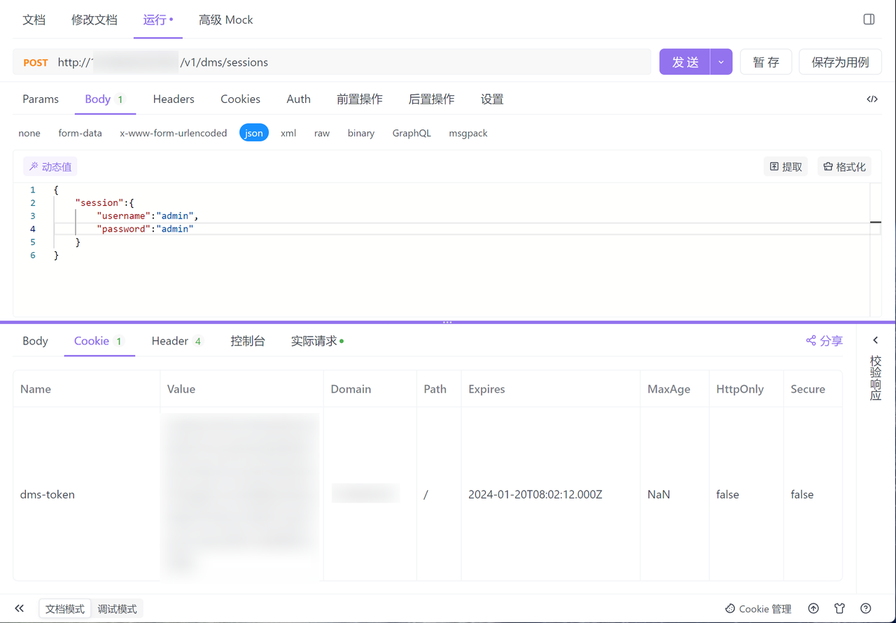
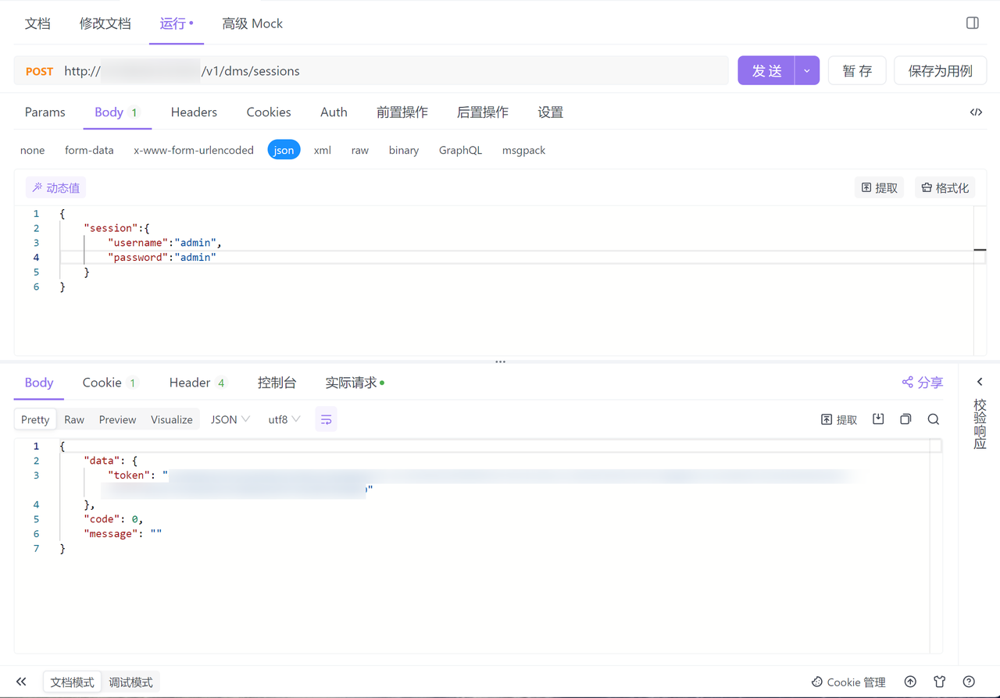

本文档旨在介绍如何将您的应用与 SQLE 进行对接，将 SQLE 成为应用生态中的一环，并利用其提供的 SQL 审核和智能扫描等能力。对接 SQLE 是 SQLE 社区中常见的需求之一。为了帮助开发者顺利完成应用与 SQLE 的对接，本文档提供了对接 SQLE 的基本思路，并记录了一些常见问题的解答。本文档也会持续更新。如果您需要进一步的支持，请加入 SQLE 社区服务群，提出您的需求，我们将竭诚为您服务。👉[社区支持](../../support/community-support.md)


## 调用登录SQLE的接口获取dms-token
在SQLE更新到3.0之后，DMS接管了SQLE的部分功能，前端通过访问DMS来访问SQLE，用于鉴权的token存放在Cookie的`dms-token`中，若要获取到`dms-token`，需要先调用登录SQLE的接口，使用SQLE中存在的账号及其密码登录SQLE，从响应体或响应的Cookie中获取`dms-token`。


### 请求
* 请求URL: http://{ip:port}/v1/dms/sessions
* 请求方法: POST
* Content-Type: application/json

#### 请求体/负载示例：
```
{
    "session":{
        "username":"用户名称",
        "password":"用户密码"
    }
}
```

### 响应

您可以在Cookie中获取到`dms-token`值

|Name|Value|Domain|Path|Expires|MaxAge|HttpOnly|Secure|
|---|---|---|---|---|---|---|---|
|dms-token|{dms-token值}|{ip地址}|-|{dms-token过期时间}|-|-|-|



您也可以在响应体中获取到dms-token值
```
{
    "data": {
        "token": "{dms-token值}"
    },
    "code": 0,
    "message": ""
}
```



## 使用dms-token调用SQLE的接口
在接下来请求的Cookie中带上 `dms-token`。SQLE会使用`dms-token`进行鉴权。

以进行SQL审核的接口为例：

```
Method: POST 
URL: http://dms_ip:dms_port/sqle/v1/projects/default/sql_audit_records
Content-Type: multipart/form-data; 
Cookie: dms-token={dms-token值}
Payload:
  instance_name: MySQL
  instance_schema: test_schema
  sqls: show tables;
```


### 注意事项
SQLE的大部分接口都会对`dms-token`进行校验，若未携带`dms-token`或携带错误的`dms-token`，请求都会被拦截，从而导致失败。
请求未携带`dms-token`时，响应如下：

```
{
    "message": "can not find dms-token"
}
```

请求携带错误的dms-token时，响应如下：
```
{
    "message": "invalid or expired jwt"
}
```

## 对接SQLE的功能

### 确认接口调用流程：
若您需要对接某个SQLE的功能，可以打开SQLE的前端界面，点击F12打开开发人员工具，对您想要对接的功能进行操作，然后参考前端界面的接口调用流。即可确认接口调用的流程。

在[使用dms-token调用SQLE的接口](#使用dms-token调用sqle的接口)中，示例的SQL审核的接口是创建SQL审核的http调用流程的其中一步，要完整的对接SQL审核功能，可以参考前端的调用


### 确认接口参数
接口可以参考在github上的开源项目的swagger接口文档。
  1. SQLE的Swagger文档地址：https://github.com/actiontech/sqle/tree/main/sqle/docs
  2. DMS的Swagger文档地址：https://github.com/actiontech/dms/tree/main/api


喜欢的话可以给我们一个Star呢！(●'◡'●)