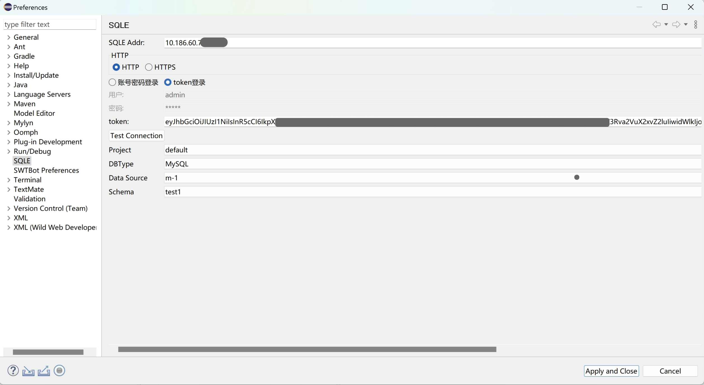

Eclipse审核插件可以在开发阶段实时进行自助式的SQL审核，确保SQL开发符合规范并满足上线要求。

## 环境要求

* 推荐使用Java8版本

* Eclipse插件最低适配Eclipse 2015 mars版本

## 使用方式

### 获取安装包
参考：https://github.com/actiontech/sqle/releases/tag/v3.2401.0

### 安装插件
将下载的jar包，复制到Eclipse编辑器目录中的dropins文件夹中

### 配置插件
1. 进入配置页面
   1. 点击`Eclipse菜单栏`-`Window`-`Preferences`-`SQLE`。
2. 输入连接信息
   1. 在SQLE Addr栏中输入SQLE服务的地址
   2. 选择HTTP连接方式
   3. 输入登录信息
      1. 选择账号密码登录时，需要填写用于登录的账密信息
      2. 选择token登录时，需要填写在个人中心生成的[访问令牌](../../user-manual/user-manager/account.md)
   4. 点击`Test Connection`按钮，确保能够成功连接到SQLE并获取项目和数据库类型列表。
3. 选择审核的数据对象
   1. 依次选择Project、DB Type、Data Source和Schema下拉框，配置要进行审核的数据库信息。
4. 保存配置
   1. 点击`Apply and Close`按钮保存配置并退出配置界面，完成配置。

#### 配置说明

| 配置项             | 配置项说明                                            |
|-----------------|--------------------------------------------------|
| SQLE Addr       | SQLE 服务地址, 格式为 IP:Port                           |
| HTTP       | 指定连接SQLE的方式是通过HTTP还是HTTPS                         |
| UserName        | 登录SQLE使用的用户名                                     |
| Password        | 登录SQLE使用的密码                                      |
| Test Connection | 测试连接是否成功, 将尝试登录SQLE                               |
| Project         | 项目名称                                             |
| DB Type         | 当其他配置正确时，该下拉菜单将自动获取支持审核的数据库实例类型，并使用该实例类型的审核规则进行审核 |
| Data Source     | 数据源名称                                            |
| Schema          | 数据库名称                                            |

### 使用说明
按照以下步骤使用插件：

1. 选中需要审核的SQL语句，可以同时选中多条。
2. 右键点击选中的SQL语句，选择[SQLE SQL Audit]，插件将以视图的形式展示审核结果。

1. 若要审核MyBatis XML文件或SQL文件，选中对应的文件，右键点击，选择[SQLE MyBatis Audit]。

:::tip
目前还支持对文件夹进行SQL审核，但仅支持审核文件夹中的XML文件。
:::

### 后续操作
Eclipse中产生的审核操作，将同步记录到SQLE平台，您可以在平台查看[历史审核记录](../../user-manual/project/IDEaudit.md)。