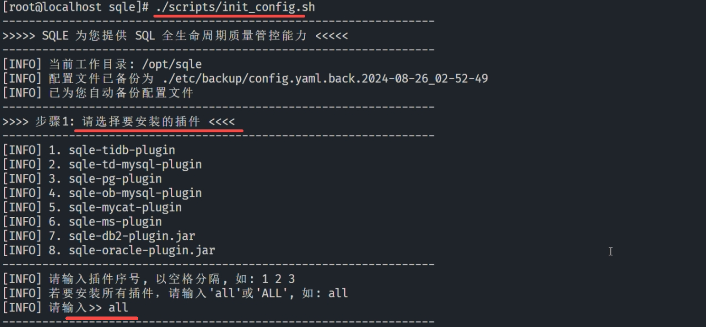
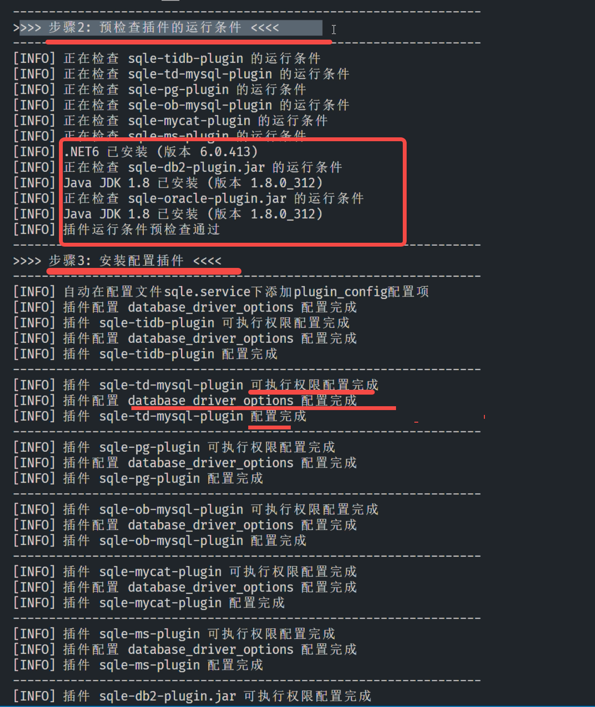
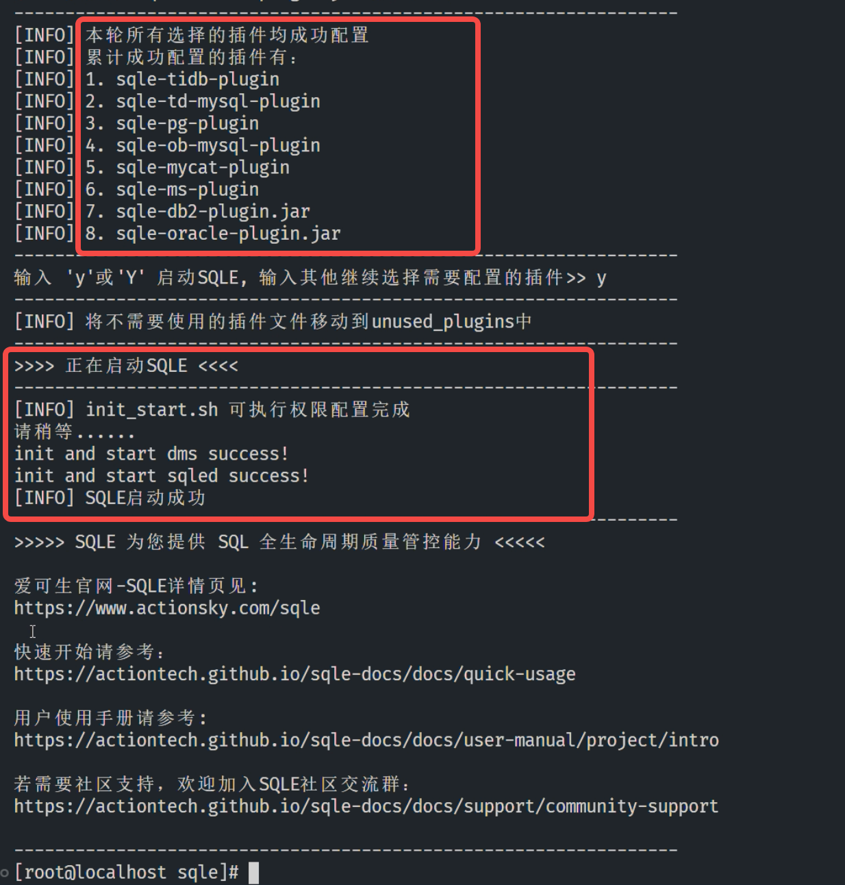

## 配置插件
### 选择需要启用的数据源类型

1. 进入SQLE目录下的scripts目录，执行插件配置脚本；
2. 输入需要使用的数据源插件序号；
3. 随后，脚本将结合选定的数据源插件序号，自动执行以下行为：
   1. 校验当前环境信息是否满足插件运行条件，如java环境校验、donet环境校验；
   2. 环境校验成功后，修改插件执行权限，并将未启用的插件移除当前目录；
   3. 修改config.yaml文件；
4. 配置完成后，脚本将启动SQLE服务；

### 完整操作流程参考

执行脚本运行命令并选择数据源插件序号 ./init_config.sh

脚本自动执行环境校验

脚本自动修改相关配置并启动SQLE

## 新增插件

1. 进入SQLE目录下的scripts目录，执行插件配置脚本；
2. 输入需要使用的数据源插件序号（注：已启用的数据源插件需要也需要填写）；
3. 后续操作与[配置插件](#配置插件)一致；

## 删除插件

1. 进入SQLE目录下的scripts目录，执行插件配置脚本；
2. 输入需要使用的数据源插件序号，不再填写需要删除的数据源插件序号；
3. 后续操作与[配置插件](#配置插件)一致；

:::tip
1. 针对Oracle和DB2类型的数据源，须先在SQLE环境中安装JDK
yum install java-1.8.0-openjdk* -y
1. 针对Sql Server类型的数据源，需要安装 .net 6.0 版本
* unbuntu
  * apt-get install -y dotnet-sdk-6.0
* centos
  * rpm -Uvh https://packages.microsoft.com/config/rhel/7/packages-microsoft-prod.rpm
  * yum install -y dotnet-runtime-6.0
  * yum install -y aspnetcore-runtime-6.0
:::
