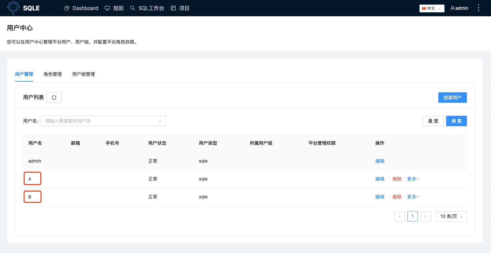
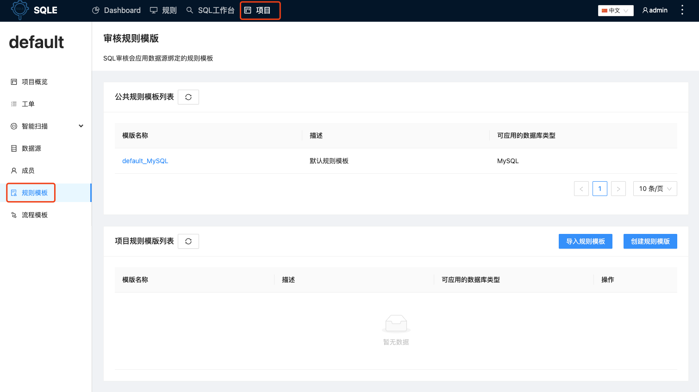
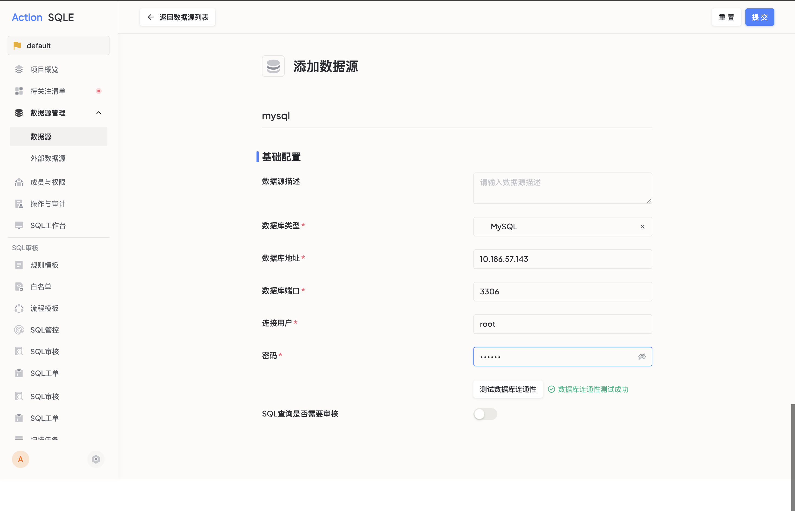
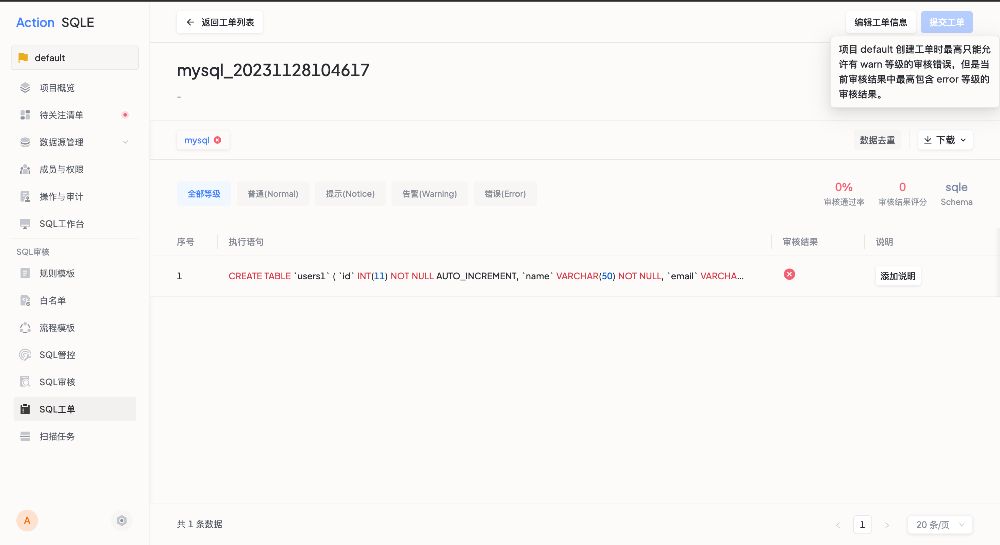
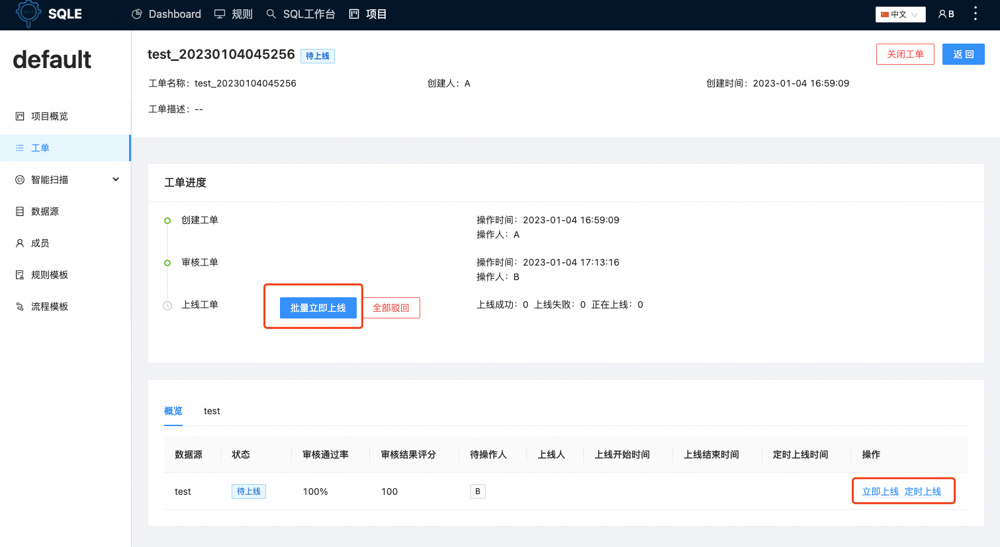

# 快速开始
本文的目的是让大家能快速体验SQLE的基础功能，帮助大家快速上手SQLE。下面将模拟一个简单的日常SQL上线场景，开发人员提交SQL，DBA进行SQL审核并上线，大概的步骤如下：
1. 管理员 admin 添加全局用户 A 和 B；
2. 管理员 admin 添加全局角色 dev 和 dba；
3. 管理员 admin 配置项目资源：
   * 给项目配置SQL审核规则；
   * 给项目添加数据源；
   * 给项目配置人员 A 和 B；
4. A 作为开发人员提交SQL审核并创建工单；
5. B 作为 DBA 进行审核并上线。
## 搭建环境
首先参考[部署文档](./deploy-manual/intro)快速搭建一个SQLE服务。
## 配置资源
### 创建全局用户
使用 admin 用户进入用户中心界面添加全局用户 A 和 B；点击SQLE顶部菜单右侧`三个点`下拉菜单即可进入。

### 创建全局角色
使用 admin 用户进入用户中心界面添加全局角色 dev 和 dba，使得 dev 至少具备权限`创建/编辑工单`, dba 至少具备权限`审核/驳回工单`，`上线工单`；点击SQLE顶部菜单右侧`三个点`下拉菜单即可进入。

### 给项目配置SQL审核规则
使用 admin 用户进入项目界面，根据自身公司的审核标准配置审核规则，本次试用不再新建规则模版，将使用提供的全局默认规则模版进行测试。如何设置规则模版，参考：[规则模版](./user-manual/project/rule-template-manager)。

### 给项目创建数据源
使用 admin 用户进入项目界面，录入一个MySQL类型的数据源 `test`，并可以绑定上一步骤中创建的规则模版，这里绑定系统内置的全局默认规则模版。如何管理数据源，可参考：[数据源](./user-manual/project/instance-manager)。

### 给项目添加成员
使用 admin 用户进入项目界面，给项目添加成员，本次的重点是要讲上述创建的全局用户添加到项目内，给用户 A 授予数据源 `test` 上的 `dev` 角色，给用户 B 授予数据源 `test` 上的 `dba` 角色。

## SQL 上线
### 开发用户 A 提交工单
使用 A 用户进入项目界面，点击创建工单即可对项目内授权过的数据源进行SQL审核上线。

:::caution
当我们提交下图所示的SQL时，自动审核触发了审核建议，则此时工单无法提交需要修改SQL符合规范后再次提交。
:::

:::tip
按要求优化SQL后，再次提交，自动审核通过
:::

提交工单后，工单流转到用户B进行后续处理。

### DBA用户 B 上线
使用 B 用户进入SQLE后，即可看到由A提交的上线工单，点击详情后可进行审批操作。
:::tip
SQLE 支持通过邮件，微信企业号等途径推送工单通知。也可以配置工单对接来在钉钉上进行工单审批
:::

