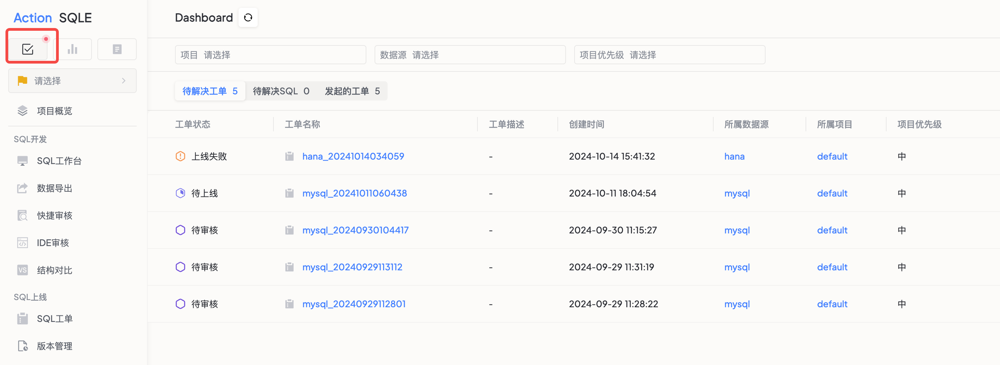

全局 Dashboard 是登录后的默认首页，帮助用户集中查看跨项目的待处理事项，无需在不同项目间切换。

## 功能入口

点击页面左上角的 **全局 Dashboard** 按钮，或登录后自动进入。

## Dashboard 内容

### 待处理工单

| 标签 | 说明 | 适用角色 |
|------|------|---------|
| 需我审核 | 当前用户作为审核人的待审核工单 | DBA / 审核人 |
| 需我上线 | 当前用户作为上线人的待上线工单 | DBA / 上线人 |
| 我创建的 | 当前用户创建的所有工单及其状态 | 开发人员 |

点击工单名称可直接跳转至工单详情页，快速执行审批或上线操作。

### 待解决 SQL 问题

展示各项目中待处理的 SQL 管控问题（来自智能扫描和 SQL 审核）。点击具体 SQL 可查看详细信息并进行针对性优化。

### 统计概览

Dashboard 顶部展示关键统计指标：

- 待审核工单数
- 待上线工单数
- 待处理 SQL 数
- 近期工单趋势

## 不同角色的使用建议

| 角色 | 关注重点 |
|------|---------|
| 开发人员 | 查看「我创建的」工单状态，关注审核结果和驳回原因 |
| DBA | 查看「需我审核」和「需我上线」标签，及时处理待办 |
| 平台管理员 | 关注统计概览，了解平台整体运行状态 |
