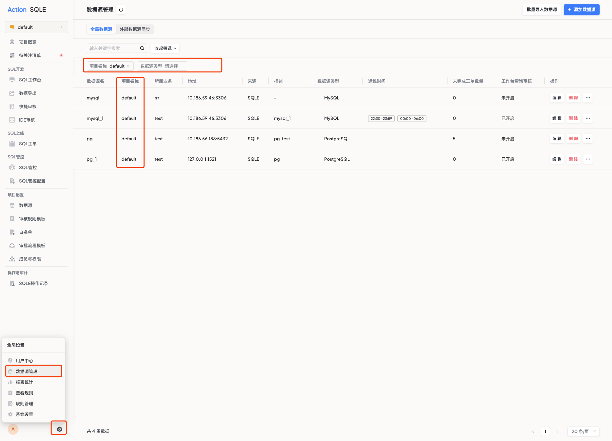

---
title:全局数据源管理
---
# 全局数据源管理

* 当需要对多个项目中的数据源进行统一修改或查看时，此功能可以帮助迅速定位并进行操作。
* 当需要进行跨项目管理工作时，可以使用该功能，确保对数据源的分布和配置情况一目了然，实现更高效的数据源管理和项目协调。

## 使用步骤

* 导航至全局设置，选择数据源管理页面，以访问平台管理的所有数据源列表。
* 利用提供的筛选工具，根据项目需求或特定条件，精确筛选出您关注的数据源。

