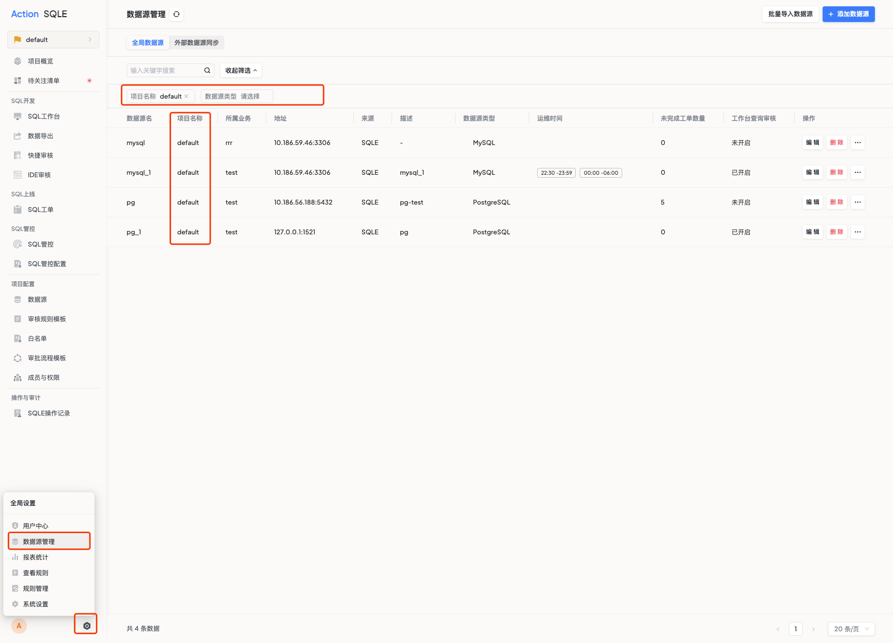

全局数据源管理提供跨项目的数据源统一视图，方便管理员快速定位和管理分布在不同项目中的数据源。

## 适用场景

- 需要跨项目统一查看和管理数据源
- 需要了解数据源在各项目中的分布情况

## 功能入口

导航至全局设置，选择 **数据源管理** 页面。

## 操作说明

| 功能 | 说明 |
|------|------|
| 查看数据源列表 | 展示平台所有项目中的数据源 |
| 筛选数据源 | 按项目、数据源类型等条件筛选 |
| 跳转至数据源 | 点击数据源名称可跳转至对应项目的数据源详情 |

