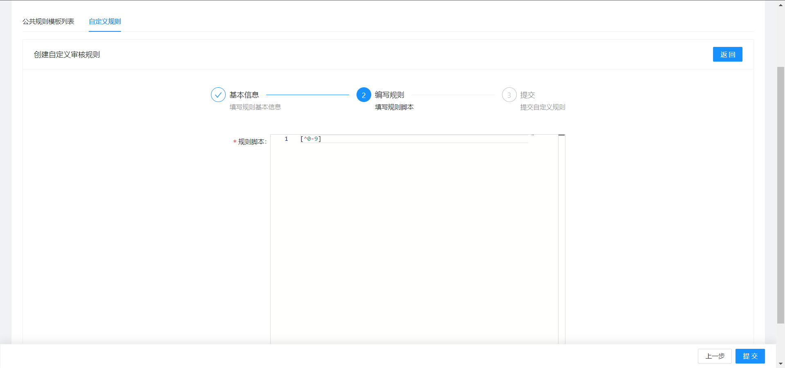
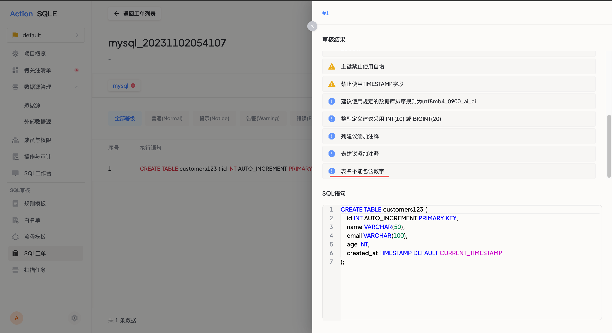

## 使用场景
自定义审核规则是平台提供的功能，用于根据业务需求创建新的审核规则。用户可以利用平台的自定义规则功能，通过正则表达式定义SQL审核的规范，并将新建的审核规则作为全局资源使用。

## 使用步骤

### 新建自定义规则

1.以平台管理员身份登入，点击`设置`，选择`规则管理`后，选择`自定义规则`标签；

2.点击`新建`,填写规则基本信息，并输入正则表达式，确认无误后，点击提交，即可完成自定义规则创建；

:::tip
当前支持golang正则语法。
:::

### 应用自定义规则
1.编辑数据源应用的规则模板，启用新建的自定义规则；
2.创建工单，新建表`customers123`，从工单审核结果中可以看到自定义规则已生效；

:::tip
目前仅支持在SQLE平台新建自定义规则，暂不支持导入导出规则模板时携带自定义规则。
:::

## 后续操作

目前，自定义规则也支持编辑知识库页面，以进一步优化审核规则的使用。可以参考[知识库](./knowledgebase.md)
