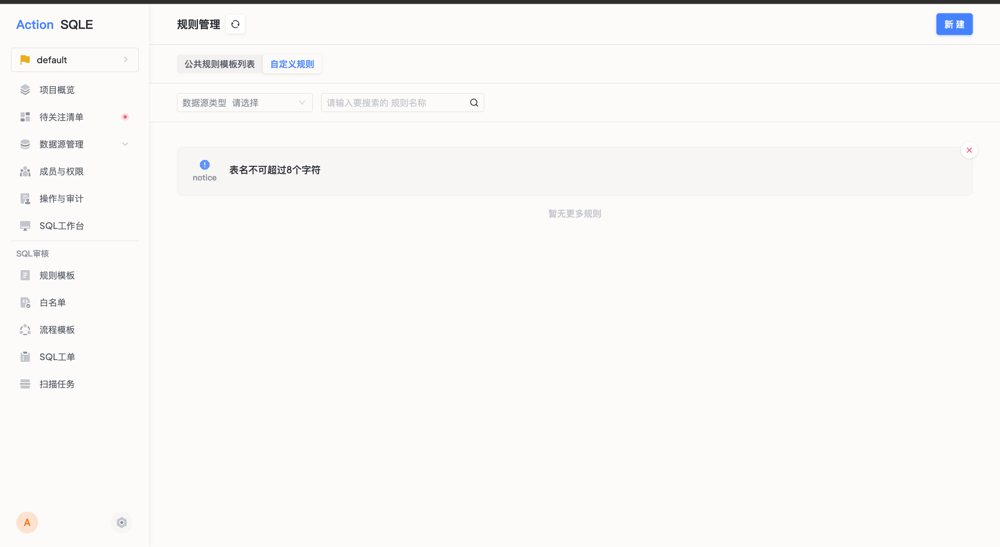
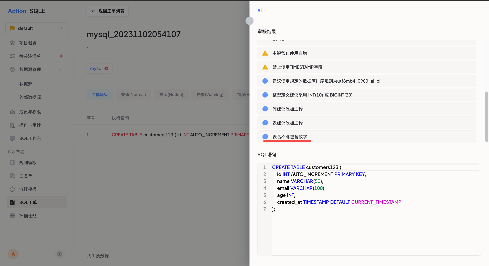

自定义审核规则允许平台管理员通过正则表达式创建企业私有的审核规则，作为全局资源在所有规则模板中使用。

## 前置条件

- 当前用户为平台管理员

## 创建自定义规则

1. 点击顶部导航栏 **设置 → 规则管理**，选择 **自定义规则** 标签
2. 点击 **新建**，填写规则基本信息并输入正则表达式
3. 点击 **提交** 完成创建

:::tip
当前支持 Go 语言正则语法。
:::

## 应用自定义规则

1. 编辑数据源绑定的规则模板，启用新建的自定义规则
2. 创建工单时，自定义规则将参与 SQL 审核

:::tip
自定义规则目前不支持通过导入/导出规则模板携带。
:::

## 后续操作

- 为自定义规则编辑知识库内容，参见 [知识库](./knowledgebase.md)
