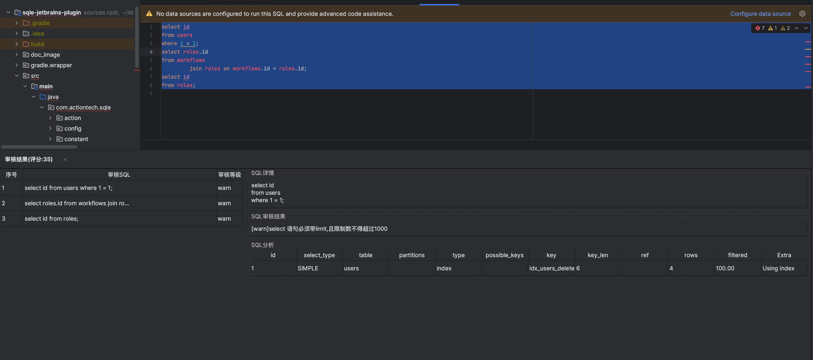

该项目是SQLE 的 [IDEA](https://github.com/actiontech/sqle-jetbrains-plugin) 审核插件 , 该插件满足开发人员在开发阶段进行实时自助式的静态SQL审核，实现开发阶段审核上线等各个SQL开发阶段的SQL开发规范。

## 下载地址
[插件下载地址](https://github.com/actiontech/sqle-jetbrains-plugin/releases)

## 安装说明
* 将插件拖放到 IDEA 或 其他类似软件中(如Goland), 插件即可完成自动安装
* 也可以在 `File` - `settings` - `Plugins` 中手动安装


### 升级说明
* 在 `File` - `settings` - `Plugins` 中卸载旧版插件
* 安装新版插件

## 使用说明
### 配置插件
1.点击 `File` - `settings`  进入设置界面


2.点击在左侧菜单最下方 `SQLE`


3.填写SQLE环境信息, 点击 `OK` 保存


#### 配置参数说明

|配置项|配置项说明|
|---|---|
|SQLE Addr|SQLE 服务地址, 格式为 IP:Port|
|http/https按钮|指定连接SQLE的方式|
|UserName|登录SQLE使用的用户名|
|Password|登录SQLE使用的密码|
|Test Connection|测试连接是否成功, 将会尝试登录|
|DB Type|当其他配置正确时，该下拉框会自动获取支持审核的实例类型。选择实例类型后，平台将使用该实例类型应用的审核规则进行审核。|

### 使用插件
1.选中需要审核的SQL, 可以同时选中多条SQL；

2.点击右键, 选中 [SQLE] - [Audit] , 也可以使用快捷键 [Ctrl] + [Shift] + [H]


3.插件会以弹窗的形式将审核结果进行展示


## 常见问题解答
#### 为什么插件配置项中的 [DB Type] 点击时偶尔会卡一下
这是因为点击下拉框时下拉框会连接SQLE获取支持的实例类型, 这个过程可能会出现网络延迟

#### SQLE在审核时使用的规则模板是什么
SQLE会根据设置中指定的数据库类型, 选择对应类型的默认模板进行审核, 且只会使用默认模板中的静态审核规则

#### 我没有SQLE环境可以使用这个插件吗
SQLE有演示环境, 如果只是想尝试一下这个插件可以连接[演示环境](/docs/online-demo.md)

#### 插件支持哪些IDE
Jetbrains家的所有软件和 [Android Studio] 都是支持的

#### SQLE插件的配置存在什么地方
```
 {用户根目录}\AppData\Roaming\JetBrains\{idea版本号对应目录}\options\SQLESettings.xml
```
|变量|说明|
|---|---|
|用户根目录|一般为 C:\Users 目录下和用户名同名的目录, 内部一般包含 '桌面', '下载' 等文件夹|
|idea版本号对应目录|一般为 软件名版本号 的格式, 如社区版idea 2022.1版本对应目录名为 IdealC2022.1|