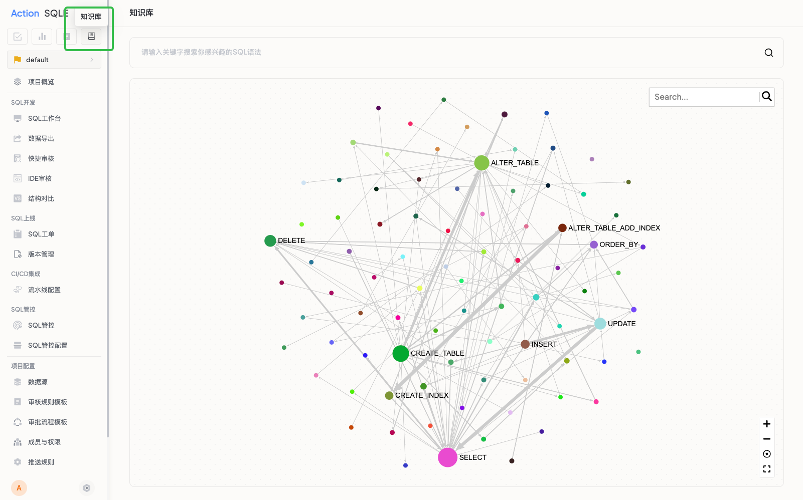
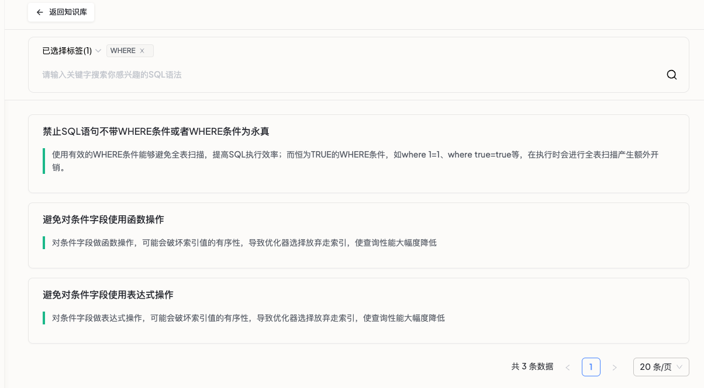
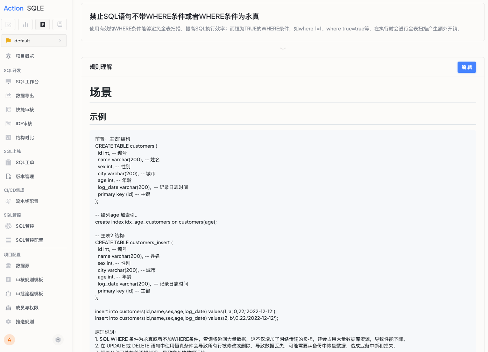

# 规则知识库

## 功能概述

### 数据库语法知识图谱
数据库语法知识图谱是一款将复杂的SQL语法规范转化为直观图形化展示的工具，帮助用户快速查找、理解和应用SQL规范知识。用户可以将知识图谱作为起点，更深入和全面地了解规则，以实现更高效的开发和优化工作。

## 应用场景

- 日常开发需要查询特定SQL语法规范时
- 系统性学习数据库规范时
- 新员工入职培训时

### 核心功能

- 知识图谱可视化展示
- 快速检索定位
- 详细规范说明

## 主要特点

- **直观可视化**：将复杂的SQL语法规范转化为直观的知识图谱
- **精准定位**：可快速定位到需要的语法节点，如"varchar长度限制"、"索引命名规则"等
- **学习效率高**：新人1小时可掌握原本需3天才能理清的知识脉络

## 前置条件

- 获取该数据源类型的知识库License

## 使用入口

1. 知识图谱入口：菜单栏右上角
2. 规则知识库入口：
   - 系统设置 → 查看规则 → 规则知识库 → 查看更多
   - SQL审核/工单/扫描任务详情页 → 规则说明 → 查看更多

## 操作指南

1. 进入知识图谱页面
2. 在搜索框中输入关键词或浏览图谱结构
3. 点击感兴趣的节点查看详细规范
4. 查看相关规范说明和示例

