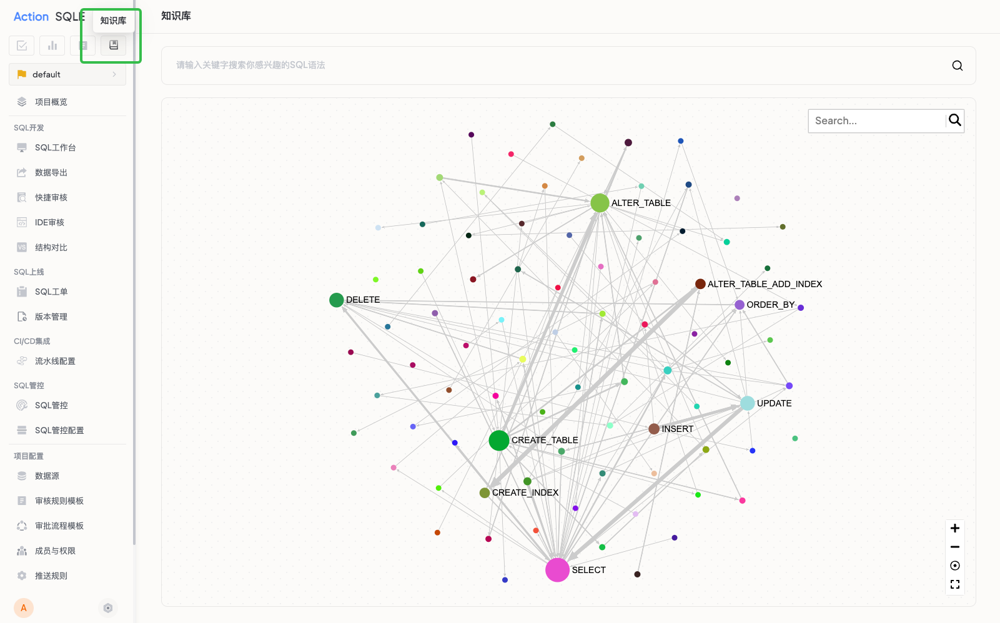
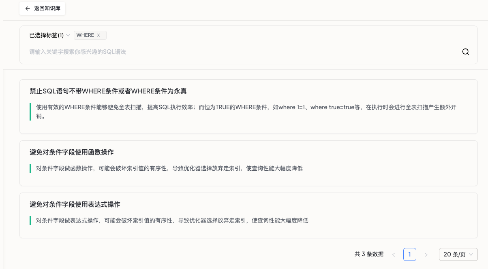

规则知识库将 SQL 语法规范转化为直观的知识图谱，帮助用户快速查找、理解和应用 SQL 规范知识。

## 适用场景

- 日常开发中查询特定 SQL 语法规范
- 系统性学习数据库规范
- 新员工入职培训

## 功能特点

| 特点 | 说明 |
|------|------|
| 知识图谱可视化 | 将复杂的 SQL 语法规范转化为直观的图形展示 |
| 精准检索 | 快速定位到需要的语法节点（如 varchar 长度限制、索引命名规则等） |
| 详细规范说明 | 每个节点配备完整的规范解释和示例 |

## 前置条件

- 获取对应数据源类型的知识库 License

## 功能入口

| 入口 | 路径 |
|------|------|
| 知识图谱 | 菜单栏右上角 |
| 规则知识库 | 系统设置 → 查看规则 → 规则知识库 → 查看更多 |
| 审核结果 | SQL 审核/工单/扫描任务详情页 → 规则说明 → 查看更多 |

## 使用方法

1. 进入知识图谱页面
2. 在搜索框中输入关键词或浏览图谱结构
3. 点击感兴趣的节点查看详细规范
4. 查看规范说明和示例

