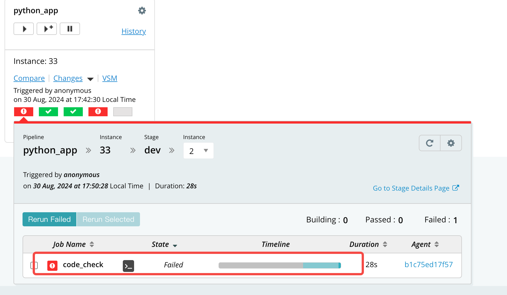
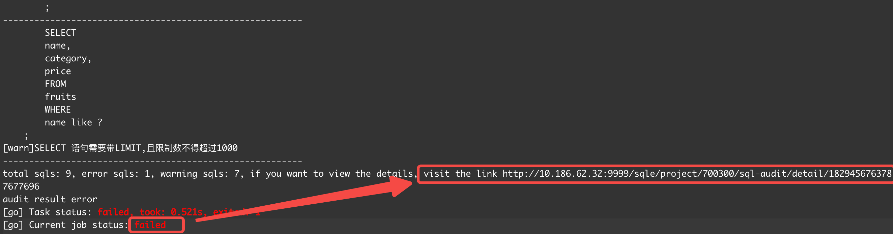

在代码提交和版本迭代的关键节点，为确保代码在合并至主分支或部署至生产环境前，SQL代码的质量得到严格把控，防止不良SQL影响生产，您可以将SQLE的审核功能嵌入到您的流水线中。这一集成操作将在代码提交时自动启动SQL质量检测，不仅确保了代码库中SQL语句的高标准和性能，同时也简化了集成过程，减少了对接成本。

## 前置条件

用户已在CI/CD平台创建流水线

## 集成审核能力

### 步骤一 平台上配置审核节点

在CI/CD集成中新建流水线，并填写以下字段信息
* 基本信息
  * 流水线名称：填写上游CI/CD平台创建的流水线名称，或其他方便理解、建立关联的名称
  * 流水线描述：输入对此条流水线的用途、预期等相关信息
  * 流水线地址：填写在上游CI/CD平台创建的流水线项目地址，如http(s)://ip:port/job/jobname/，方便建立关联
* 节点信息
  * 节点名称
  * 节点类型
  * 审核对象类型
  * 审核对象路径：填写要审核的SQL对象路径，帮助平台生成SQL采集指令，SQL采集指令将用于CI/CD平台配置。需要输入文件的绝对路径，如/opt/sqle/std.log，或文件所在的文件夹路径，如/opt/sqle/。
  * 审核方式：目前支持在线审核及离线审核两种方式，当需要结合数据源获取审核结果时，请选择在线审核，并指定数据源；如仅需对SQL本身做语法审核，请选择离线审核。
    * 选择在线审核时，需要指定审核使用的数据源
    * 选择离线审核时，需要指定审核SQL对应的数据源类型
  * 审核规则模板：选择平台审核SQL时应用的审核规则模板
完成节点配置后保存。

### 步骤二 获取流水线对接说明

在流水线详情中，查看当前配置的流水线节点，查看节点后的对接说明，并获取已组合好的执行命令。

### 步骤三 将流水线复制到上游CI/CD平台

结合对接说明，配置上游CI/CD流水线的相应节点并触发，一旦发现SQL不符合预设的审核规范，将终止流水线并返回审核记录的url。

### 步骤四 查看审核结果
审核的SQL及审核结果，将在SQLE页面记录，方便事后追溯

