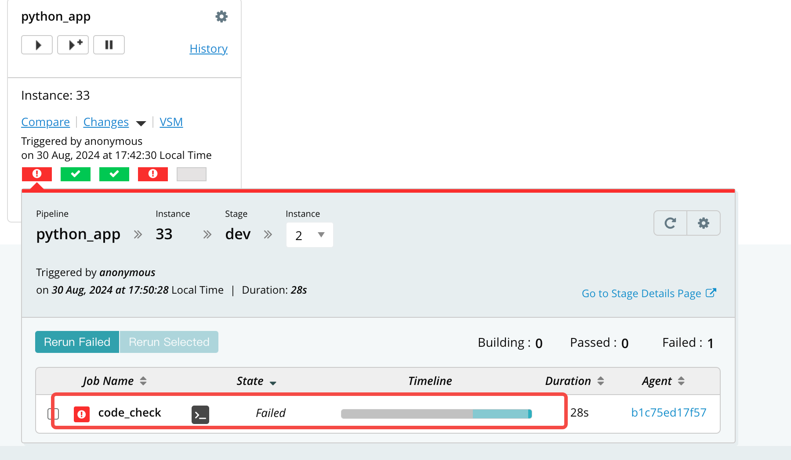
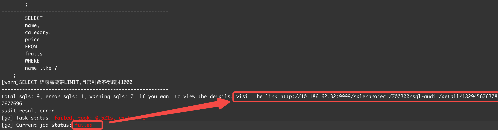

将 SQLE 审核能力嵌入 CI/CD 流水线，在代码提交时自动执行 SQL 质量检测，防止不合规的 SQL 进入生产环境。

## 前置条件

- 已在 CI/CD 平台（Jenkins、GitLab CI 等）创建流水线

## 集成步骤

### 步骤一：配置审核节点

在 SQLE 平台的 **CI/CD 集成** 页面新建流水线：

**基本信息**

| 配置项 | 说明 |
|--------|------|
| 流水线名称 | 填写上游 CI/CD 平台的流水线名称 |
| 流水线描述 | 描述流水线用途 |
| 流水线地址 | 上游 CI/CD 平台的流水线地址 |

**节点信息**

| 配置项 | 说明 |
|--------|------|
| 节点名称 | 审核节点名称 |
| 审核对象路径 | SQL 文件的绝对路径或所在目录 |
| 审核方式 | 在线审核（连接数据源）或离线审核（仅语法审核） |
| 审核规则模板 | 选择审核使用的规则模板 |

### 步骤二：获取对接说明

在流水线详情中查看各节点的对接说明和执行命令。

### 步骤三：配置上游流水线

将获取的执行命令配置到上游 CI/CD 平台的相应节点。触发流水线后，若 SQL 不符合审核规范，将终止流水线并返回审核记录的 URL。

### 步骤四：查看审核结果

审核记录在 SQLE 平台中保留，方便事后追溯。

