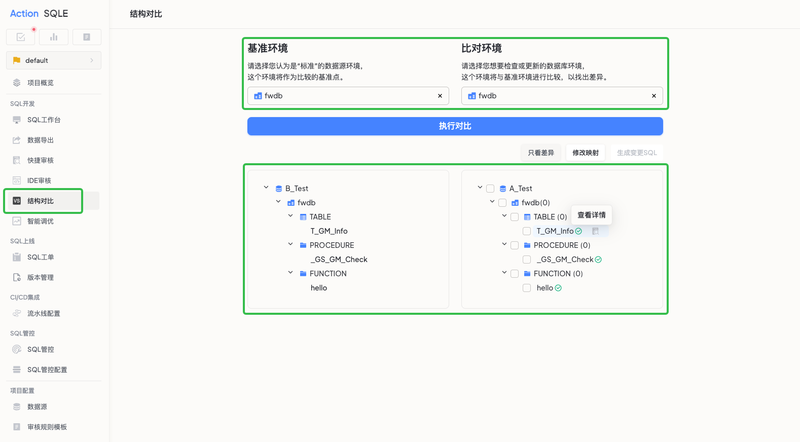
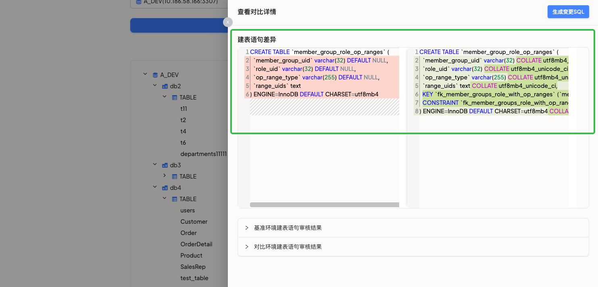
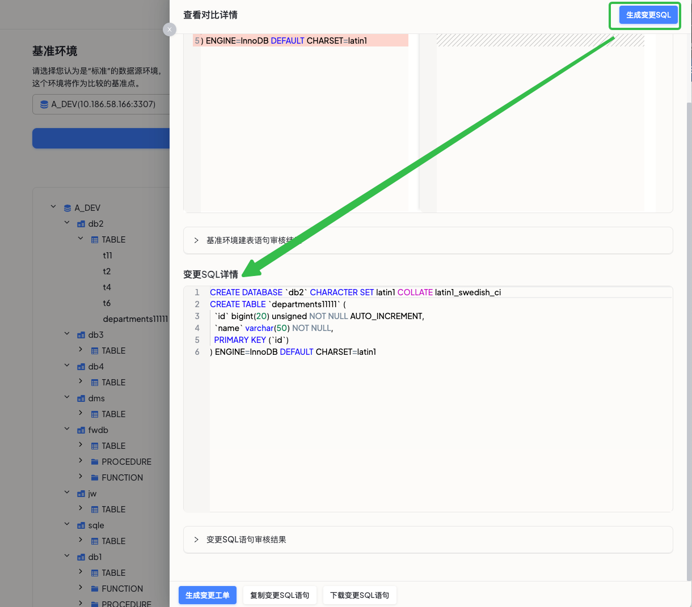

结构对比功能旨在帮助用户确保不同环境的数据库结构保持同步，让用户能够快速、准确地识别和同步不同数据库之间的差异，从而提高团队协作效率，减少因数据库不一致导致的问题。

### 使用场景

1. 多人协作开发：
   当多个开发人员在不同的数据库上工作时，结构对比功能可以帮助您快速识别和合并他们的变更，确保所有开发环境的数据库结构一致。

2. 多环境部署：
   在将应用从开发环境迁移到测试或生产环境时，使用结构对比功能可以确保数据库结构的一致性，避免因结构差异导致的应用错误。

3. 数据库迁移：
   在进行数据库迁移时，结构对比功能可以帮助您发现源数据库和目标数据库之间的差异，确保迁移过程中数据的完整性和一致性。

4. 版本控制：
   结构对比功能可以作为版本控制系统的补充，帮助您跟踪数据库结构的变更历史，便于回滚和审计。

### 支持的数据源类型
* MySQL

### 操作步骤

**1. 选择数据库对象：**

* 进入结构对比功能页面。
* 选择需要对比的两个数据库对象。
* 点击“执行对比”，系统将自动展示所有差异。

**2. 查看具体差异：**

* 当系统检测到差异时，点击数据对象后的“查看详情”按钮。
* 直观对比建表语句的具体差异，一目了然。

**3. 同步数据库结构：**

* 如果需要使两个数据源的库表结构保持一致，可以点击“生成变更SQL”按钮。
* 系统将提供将两端数据库结构同步所需的SQLcompa语句。
* 用户可以直接使用这些SQL语句，或者创建变更工单，轻松消除不同环境间的差异，确保数据一致性。
