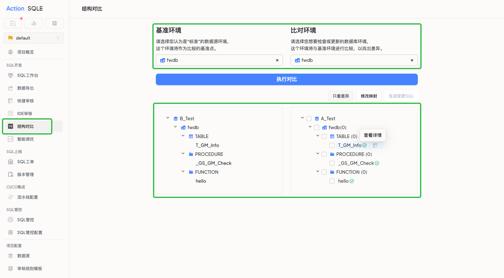
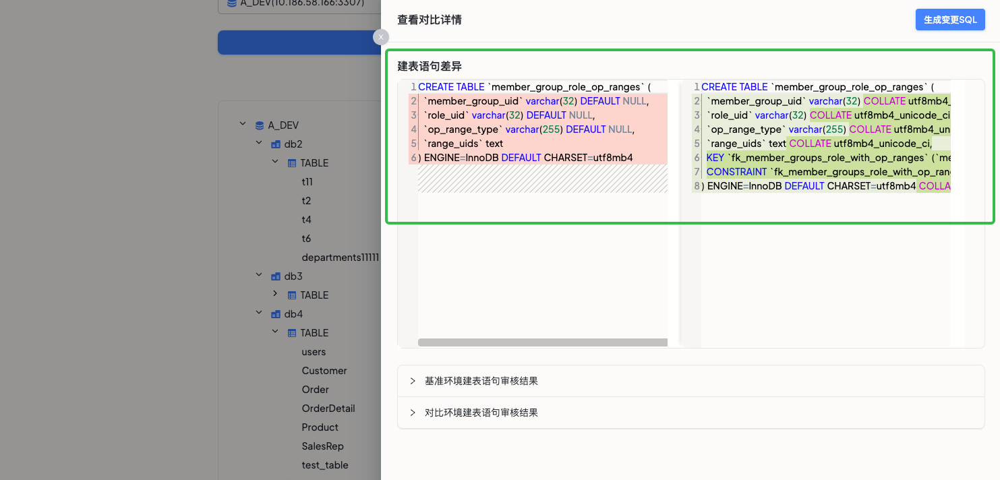
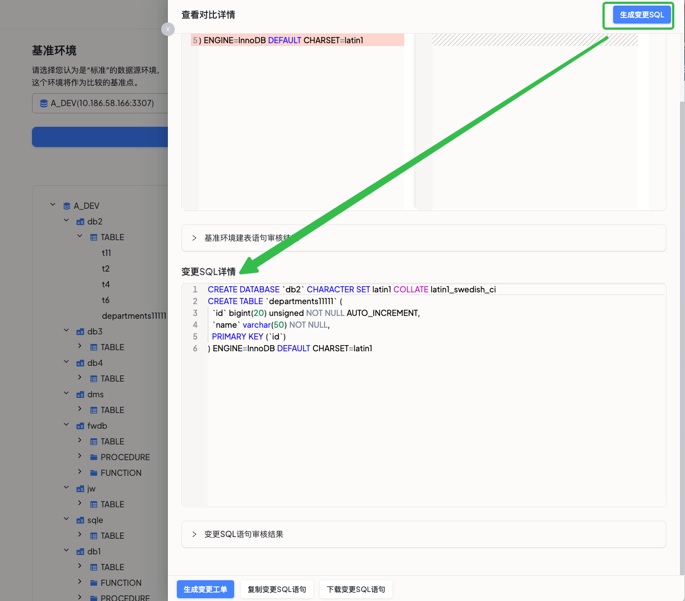

结构对比功能用于识别不同环境数据库间的库表结构差异，帮助团队确保开发、测试、生产等环境的数据库结构保持一致。

## 适用场景

- 多人协作开发：快速识别和合并不同开发者的数据库变更
- 多环境部署：确保从开发到生产环境的数据库结构一致性
- 数据库迁移：发现源库和目标库之间的结构差异
- 版本控制：跟踪数据库结构的变更历史

## 支持的数据源类型

MySQL、Oracle

## 操作步骤

### 1. 选择对比对象

进入结构对比页面，选择需要对比的两个数据库对象，点击 **执行对比**。

### 2. 查看差异

系统自动展示所有差异。点击数据对象后的 **查看详情**，可直观对比建表语句的具体差异。

### 3. 同步结构

如需使两端数据库结构保持一致，点击 **生成变更 SQL**。系统将生成同步所需的 SQL 语句，可直接执行或创建变更工单。

