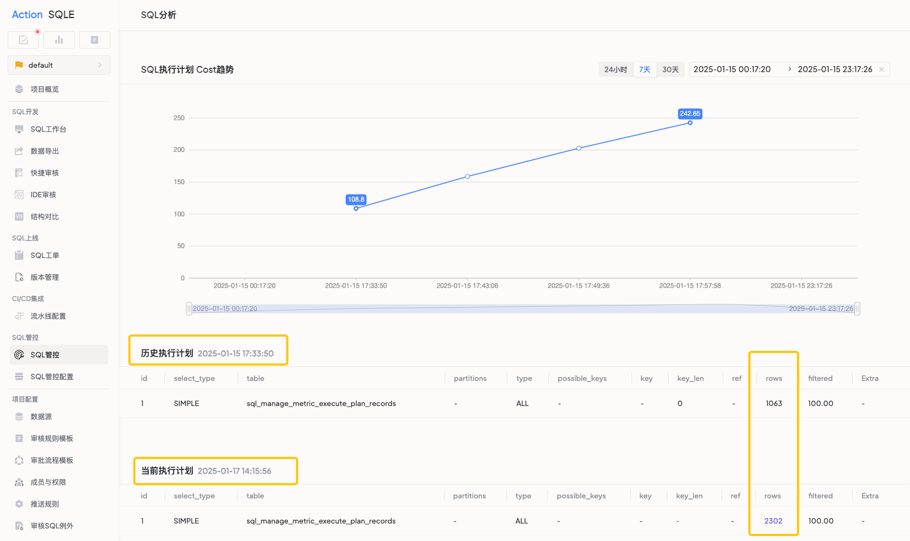

# SQL下钻分析

## 功能概述

### 功能用途
SQL下钻功能帮助用户追踪和分析SQL查询性能变化，精确定位性能劣化的时间点和原因，从而快速解决SQL查询性能问题。

### 应用场景
- 原本高效的SQL查询突然变得缓慢时。
- 需要追溯SQL性能变化历史时。
- 想要对比不同时间点的SQL执行计划差异时。

### 主要特点
- 历史性能曲线可视化展示。
- 自动识别性能突变的关键时间点。
- 执行计划智能对比。
- 一键定位性能劣化根因。

### 预期效果
快速发现并解决SQL性能问题，避免因查询效率低下而影响系统整体性能，提高数据库运维和优化的工作效率。

## 前置条件
- 开启SQL管控配置，管控如慢SQL、TopSQL等数据对象。

## 操作指南

### 功能入口位置
- SQL管控页面，点击`SQL分析`。

### 操作步骤
1. 选择需要分析的SQL语句。
2. 查看`Cost趋势`曲线图了解性能变化。
3. 定位性能突变的关键时间点。
4. 点击`执行计划对比`按钮，查看前后执行计划的差异。
5. 根据比对结果，确定性能劣化的根本原因。

## 使用规则

### 注意事项
- 平台保存30天历史数据。
- 执行计划的变化可能受多种因素影响，请综合分析。

### 使用建议
- 定期使用此功能检查关键SQL的性能变化。
- 在系统环境发生变更后，及时分析重要SQL的执行情况。
- 将发现的性能问题及时记录并解决，避免问题累积。

