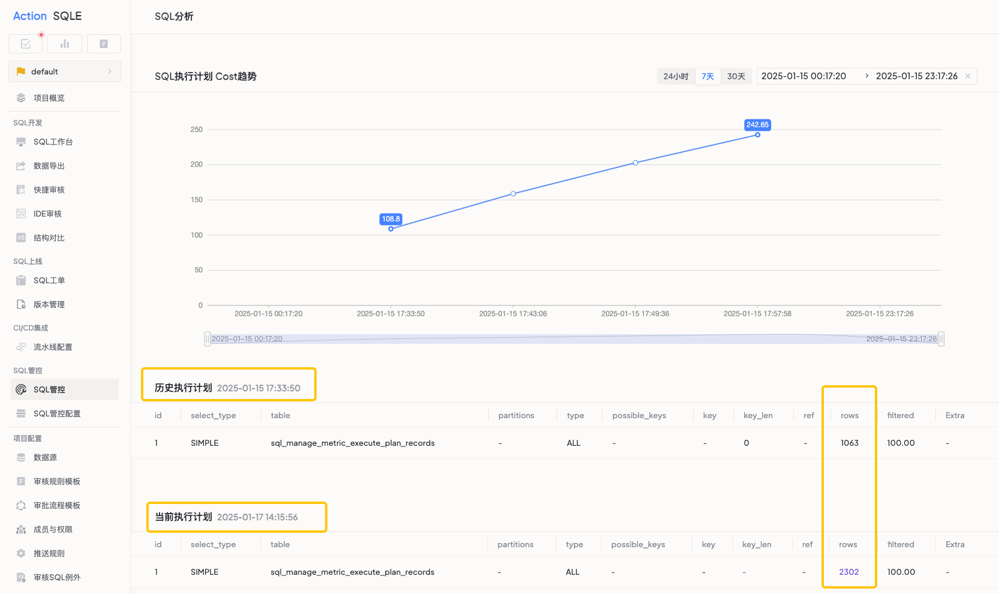

import Edition from '@site/src/components/Edition';

# SQL 下钻分析 <Edition type="enterprise" />

SQL 下钻功能用于追踪和分析 SQL 查询的性能变化历史，通过可视化的 Cost 趋势曲线和执行计划对比，精确定位性能劣化的时间点和原因。

## 适用场景

- 原本高效的 SQL 查询突然变得缓慢
- 需要追溯 SQL 性能变化历史
- 需要对比不同时间点的执行计划差异

## 前置条件

- 在 SQL 管控配置中开启了慢 SQL、TopSQL 等扫描任务

## 功能入口

SQL 管控页面 → 点击 **SQL 分析**。

## 操作步骤

1. 选择需要分析的 SQL 语句
2. 查看 **Cost 趋势** 曲线图了解性能变化
3. 定位性能突变的关键时间点
4. 点击 **执行计划对比**，查看前后执行计划的差异
5. 根据对比结果确定性能劣化的根因

:::tip
- 平台保存 30 天历史数据
- 建议在系统环境变更后及时分析重要 SQL 的执行情况
:::
