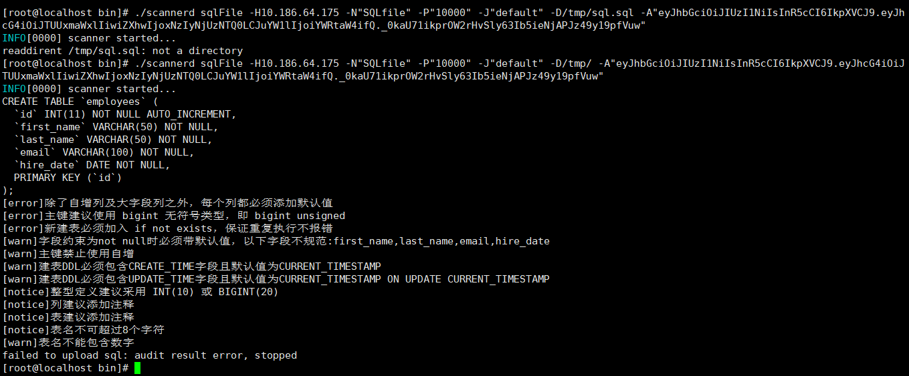

# SQL 文件扫描

SQL 文件扫描用于在批量执行 SQL 前对文件内容进行审核，发现潜在的安全风险和规范问题，提升数据库开发质量。

## 支持的数据源类型

平台已支持的所有数据源类型均支持 SQL 文件扫描。

## 前置条件

- 已在后端环境中准备好 SQL 文件

## 操作步骤

### 步骤一：创建扫描任务

进入智能扫描任务列表，点击 **新建**，选择 **SQL 文件扫描** 任务类型。

### 步骤二：执行 scannerd

:::tip
scannerd 通常位于 SQLE 安装目录的 `bin/` 下。使用 RPM 或 Docker 部署时路径相同。
:::

```bash
./scannerd sqlFile \
  -H 127.0.0.1 \
  -P 10000 \
  -J default \
  -N SQLfile \
  -D /path/to/sql/files/ \
  -A "<扫描任务凭证>"
```

| 参数 | 说明 |
|------|------|
| `-J, --project` | 扫描任务所在项目名称 |
| `-H, --host` | DMS/SQLE 主机地址 |
| `-P, --port` | SQLE 服务端口 |
| `-N, --name` | 扫描任务名称 |
| `-D, --dir` | SQL 文件所在目录 |
| `-A, --token` | 扫描任务凭证 Token，从平台页面复制 |
| `-K, --skip-sql-file-audit` | 可选。仅上传 SQL 不审核 |
| `-S, --skip-error-sql-file` | 可选。跳过无法解析的 SQL 文件 |



### 步骤三：查看审核结果

1. 进入扫描任务详情，查看已采集的 SQL
2. 点击 **立即审核**，在扫描报告中查看审核结果
