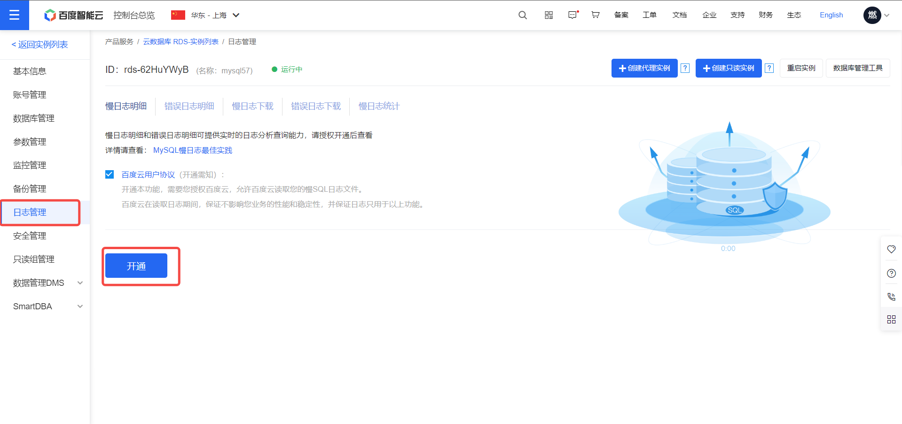
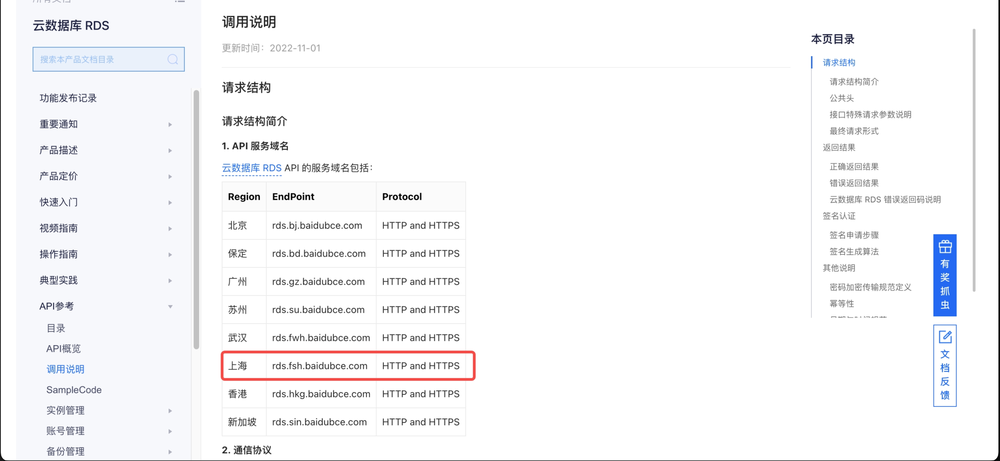

# 百度云 RDS 慢日志扫描

当使用百度云 RDS 实例时，可通过创建百度云 RDS 慢日志扫描任务，定期采集实例上的慢 SQL 并推送到 SQLE 进行审核分析。

## 支持的数据源类型

- MySQL

## 前置条件

- 已创建双机高可用版本的百度云 RDS 实例
- 已对该实例开通慢日志
- 已在平台添加对应数据源

## 操作步骤

### 步骤一：开启百度云慢日志扫描

1. 进入项目，点击左侧导航栏 **SQL 管控配置**
2. 找到目标数据源，开启智能扫描
3. 扫描类型选择 **百度云慢日志扫描**
4. 填写以下配置项：

| 配置项 | 说明 |
|--------|------|
| 实例 ID | 百度云 RDS 实例的 ID |
| Access Key | 百度云账号安全认证中的 Access Key |
| Access Secret Key | Access Key 对应的 Secret Key |
| 启动任务时拉取慢日志时间范围（小时） | 扫描任务读取慢日志的时间范围，最大 7 天（168 小时） |
| 审核过去时间段内抓取的 SQL（分钟） | 审核该时间段内抓取到的慢 SQL |
| RDS Open API 地址 | RDS 服务地址前缀，需根据实例所在区域填写 |
| 审核规则模板 | 选择对应的审核规则模板 |

**RDS Open API 地址参考**：

5. 点击 **提交** 完成配置

### 步骤二：查看采集与审核结果

在扫描详情中查看采集的百度云慢日志 SQL 及审核结果。
