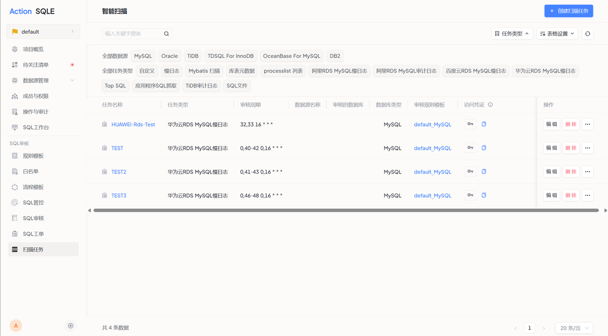

本节介绍如何通过华为云SQLE平台监管华为云RDS实例上产生的慢SQL，并进行相应的分析和审核。

## 支持的数据源类型
* MySQL

## 使用场景

如果用户正在使用华为云RDS实例，并且希望监管实例上产生的慢SQL，可以通过创建华为云RDS慢日志扫描任务实现。该任务会定期扫描华为云RDS实例上的慢日志，并将扫描结果发送到SQLE平台进行分析。

## 前置操作

在进行以下操作之前，请确保已完成以下步骤：

* 创建华为云RDS实例，并获取实例的项目ID和实例ID。
* 开启慢日志明文显示，并设置慢查询时间阈值。参考[华为云用户手册](https://support.huaweicloud.com/usermanual-rds/rds_mysql_slow_query_log.html)。
* 获取访问密钥。访问密钥文件需要下载至本地查看。参考[华为云用户手册](https://support.huaweicloud.com/usermanual-ca/zh-cn_topic_0046606340.html)。

## 操作步骤
新建智能扫描任务

* 任务名称：输入审核任务名称，必须以字母开头；
* 数据源名称：指定扫描任务实施的数据源；
* 数据库：填写需要审核的目标库，若不填则仅进行静态分析不会连库；
* 数据库类型：根据选取的数据源呈现；
* 任务类型：选择需要执行的审核任务类型，选择`华为云RDS MySQL慢日志`；
* 项目ID：实例所在项目ID；
* 实例ID：实例ID；
* Access Key ID：在步骤3中获取的访问密钥 ID；
* Access Key Secret：在步骤3中获取的访问密钥Secret；
* 启动慢日志时拉取慢日志时间范围（小时）：由于开启明文显示后，华为云平台会自动删除30天前的日志，所以时间范围上限是30天；
* 当前API开放的地区：参考[华为云用户手册](https://developer.huaweicloud.com/endpoint?RDS)；

点击`提交`，完成扫描任务创建。

## 执行结果
* 用户进入扫描任务详情，可以查看扫描任务抓取到的慢SQL。
* 点击`立即审核`，可查看对慢SQL的审核结果。

以下是华为云RDS慢日志扫描示意图：
