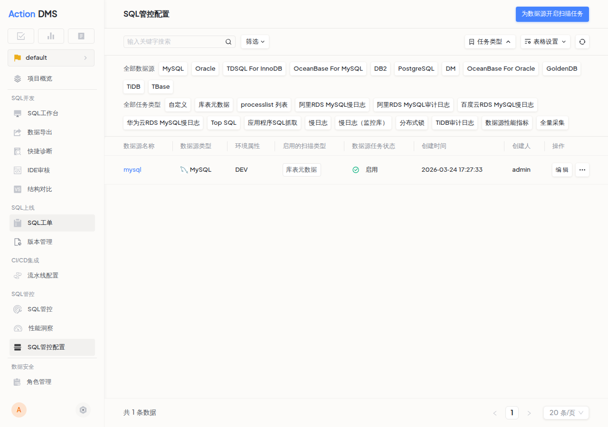

import Edition from '@site/src/components/Edition';

SQL 管控是 SQLE 平台持续监控和治理 SQL 质量的核心能力。相比一次性的工单审核，SQL 管控通过智能扫描任务对业务 SQL 进行持续采集和审核，帮助团队发现工单流程无法覆盖的问题。

## 管控与工单的互补关系

| 能力 | SQL 工单 | SQL 管控 |
|------|---------|---------|
| 审核时机 | 上线前一次性审核 | 上线后持续审核 |
| SQL 来源 | 开发人员手动提交 | 自动采集（慢日志、TopSQL 等） |
| 适用场景 | 变更上线审批 | 性能监控、质量巡检、问题追溯 |

## 管控能力总览

| 功能 | 说明 | 版本 |
|------|------|------|
| [SQL 管控列表](sqlmanage.md) | 集中查看、筛选、处理所有采集到的 SQL | 企业版 |
| [智能扫描任务](#智能扫描任务) | 配置各类数据源扫描任务，自动采集 SQL | 社区版 + 企业版 |
| [性能洞察](performance-insight.md) | 监控数据库性能指标，发现异常 | 企业版 |
| [SQL 下钻分析](SQLdrilldown.md) | 对单条 SQL 进行深度性能分析 | 企业版 |

## SQL 管控配置

在项目中，点击左侧导航栏 **SQL 管控配置**，可为数据源开启智能扫描任务和高优先级 SQL 标准。

### 高优先级 SQL <Edition type="enterprise" />

配置高优先级 SQL 的判定标准，符合条件的 SQL 将在管控列表中高亮标记。

## 智能扫描任务

智能扫描任务是 SQL 管控的数据采集源。不同的扫描任务对应不同的 SQL 采集方式：

| 扫描类型 | 说明 | 支持的数据源 |
|----------|------|-------------|
| [库表元数据](metadata_audit.md) | 扫描表结构，审核建表规范 | MySQL / DB2 / TDSQL / PostgreSQL |
| [慢日志](slowlog_audit.md) | 采集慢查询日志 | MySQL / TDSQL |
| [会话 SQL](processlist_audit.md) | 采集当前执行中的 SQL | MySQL |
| [TopSQL](topsql.md) | 采集高资源消耗 SQL | DB2 / Oracle / OceanBase / PostgreSQL / 达梦 |
| [MyBatis 扫描](mybatis.md) | 扫描 MyBatis XML 中的 SQL | 所有类型 |
| [SQL 文件扫描](SQLfile_audit.md) | 扫描指定目录下的 SQL 文件 | 所有类型 |
| [应用程序 SQL 抓取](java_application_audit.md) | 通过定制 JDBC 采集 Java 应用 SQL（企业版） | MySQL |
| [Java Agent SQL 抓取](java_agent_audit.md) | 通过 Agent 探针采集运行时 SQL（企业版） | MySQL |
| [百度云 RDS](baiduyunrds.md) | 采集百度云 RDS 慢日志 | MySQL |
| [华为云 RDS](huaweiyunrds.md) | 采集华为云 RDS 慢日志 | MySQL |
| [TDSQL 锁监控](lockinfo.md) | 采集数据库锁信息 | TDSQL |

每种扫描任务的详细配置请参见各自的文档。
