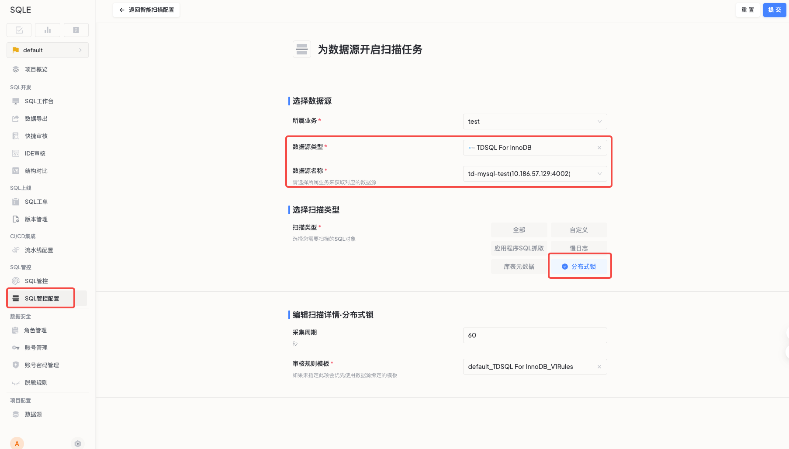
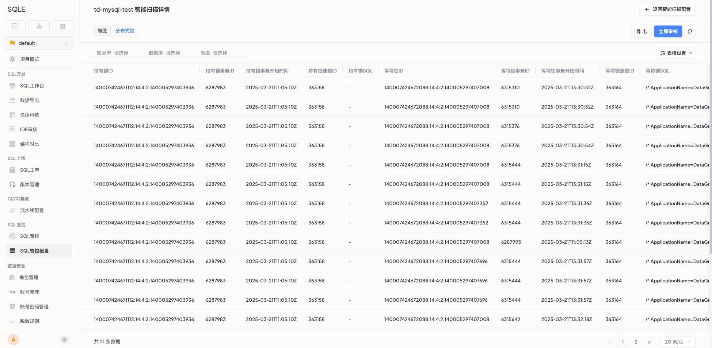

# TDSQL锁监控

## 功能概述

### 功能用途
TDSQL 锁监控是一个实时监控和分析数据库锁状态的功能，能够帮助用户快速发现并解决数据库锁冲突问题，提升系统性能和稳定性。

### 适用场景
| 场景 | 描述 |
|------|------|
| 性能问题排查 | 系统性能突然下降时的快速定位 |
| 高峰期监控 | 业务高峰期的系统响应监控 |
| 交易问题分析 | 支付交易超时等异常情况分析 |
| 性能优化 | 数据库访问效率优化和调优 |

### 主要特点
- **实时监控**：秒级发现并定位锁冲突问题
- **可视化展示**：直观呈现锁信息和趋势
- **智能预警**：自动识别异常锁等待情况
- **性能分析**：提供锁相关的性能诊断报告

### 预期效果
- 减少系统性能问题排查时间
- 提前发现潜在性能风险
- 优化数据库访问效率

## 前置条件

### 环境依赖
- 已完成 TDSQL 数据源配置

## 操作指南

### 功能入口
SQL管控配置页面

### 操作步骤
1. 进入SQL管控配置页面
2. 选择目标 TDSQL 数据源
3. 开启锁扫描功能

### 操作结果展示
用户可以在监控看板中查看：
- 锁冲突情况
- 锁等待时间
- 受影响的表/行信息
- 锁类型分布

## 最佳实践

### 使用建议
- 调整采样周期，避免高频采集带来的性能影响
- 定期分析锁监控数据，识别潜在问题
- 对频繁出现的锁冲突进行优化处理

### 性能优化建议
- 优化事务处理逻辑，减少长事务
- 合理设计索引，避免表级锁
- 适当调整事务隔离级别
