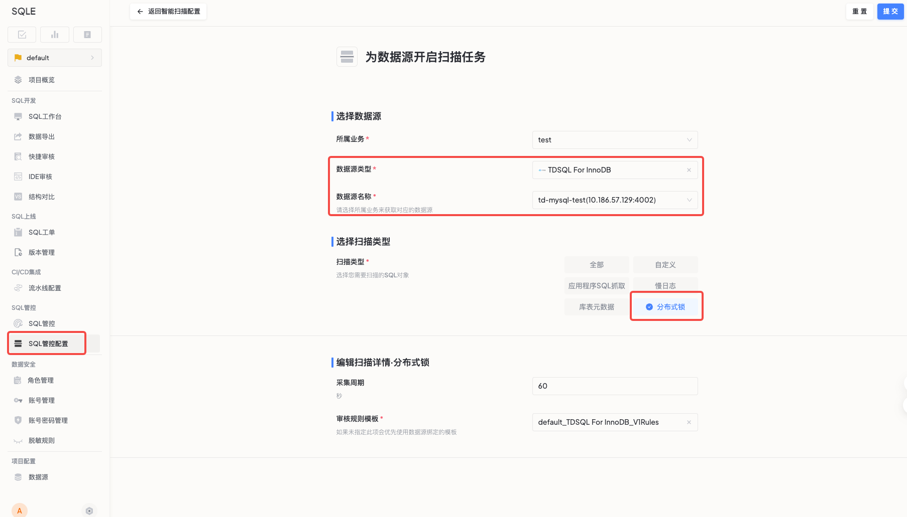
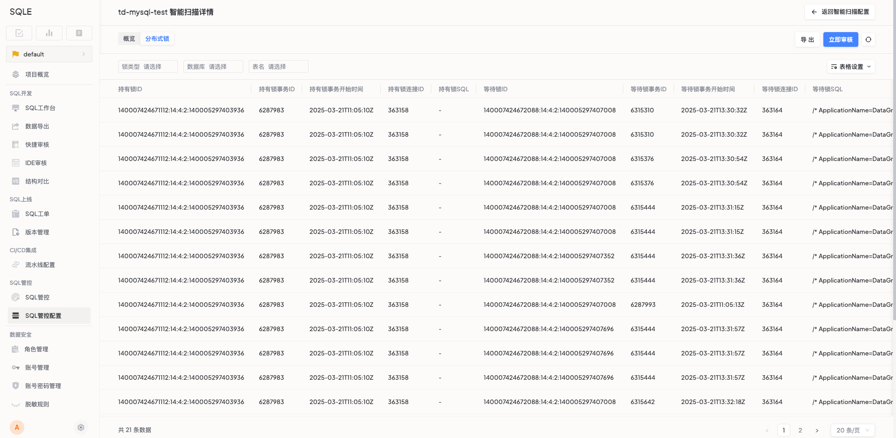

# TDSQL 锁监控

TDSQL 锁监控实时采集和分析数据库锁状态，帮助快速发现并定位锁冲突问题。适用于以下场景：

- 系统性能突然下降时的快速排查
- 业务高峰期的锁等待监控
- 交易超时等异常情况分析
- 数据库访问效率优化

## 支持的数据源类型

- TDSQL

## 前置条件

- 已在项目中添加 TDSQL 数据源

## 操作步骤

### 步骤一：开启锁监控

1. 进入项目，点击左侧导航栏 **SQL 管控配置**
2. 找到目标 TDSQL 数据源，开启智能扫描
3. 扫描类型选择 **锁扫描**

### 步骤二：查看监控结果

在监控看板中查看以下信息：

| 监控指标 | 说明 |
|----------|------|
| 锁冲突情况 | 当前存在的锁冲突数量与详情 |
| 锁等待时间 | 各锁等待的持续时长 |
| 受影响的表/行 | 锁涉及的具体表和行信息 |
| 锁类型分布 | 行锁、表锁等类型的分布情况 |

## 使用建议

- 合理设置采样周期，避免高频采集带来的性能开销
- 定期分析锁监控数据，识别频繁出现的锁冲突模式
- 对反复出现的锁问题，优化事务逻辑、减少长事务、合理设计索引
