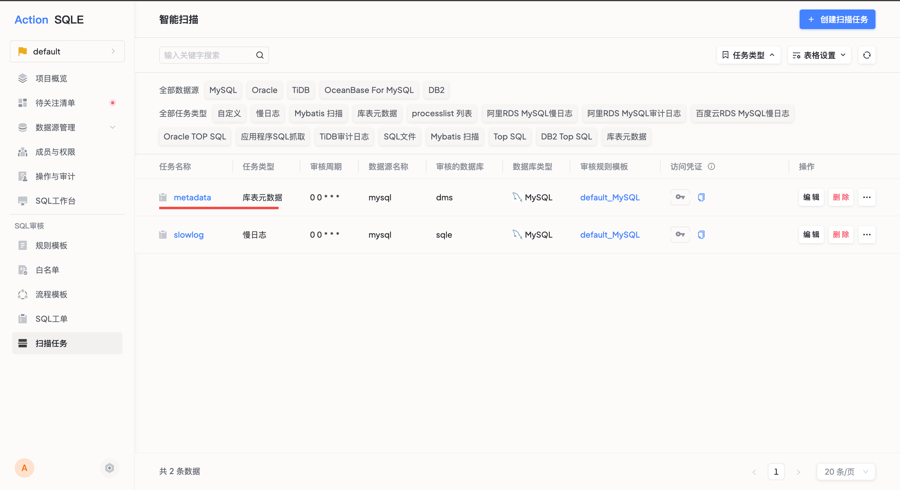

# 库表元数据扫描

库表元数据扫描定期采集数据源上的建表语句和建视图语句，审核其是否符合审核规则模板中的规范。适用于以下场景：

- 检查已上线业务的建表规范是否达标
- 定期巡检库表结构变更是否符合统一标准

## 支持的数据源类型

- MySQL
- DB2
- TDSQL
- PostgreSQL

## 前置条件

- 已在项目中添加目标数据源

## 操作步骤

### 步骤一：开启库表扫描

1. 进入项目，点击左侧导航栏 **SQL 管控配置**
2. 找到目标数据源，点击 **开启智能扫描**
3. 扫描类型选择 **库表扫描**
4. 填写以下配置项：

| 配置项 | 说明 |
|--------|------|
| 采集周期 | SQLE 采集数据的时间间隔 |
| 是否采集视图信息 | 默认关闭；开启后将同时扫描视图 SQL |
| 审核规则模板 | 选择对应的审核规则模板 |

5. 点击 **提交** 完成配置

### 步骤二：查看采集与审核结果

在扫描详情中查看采集的库表 SQL 及审核结果。

## 后续操作

- **查看审核记录**：对比不同时间点的审核结果，追踪表结构变更历史
- **分析语句**：对不符合规范的 SQL 进行分析，获取优化建议
