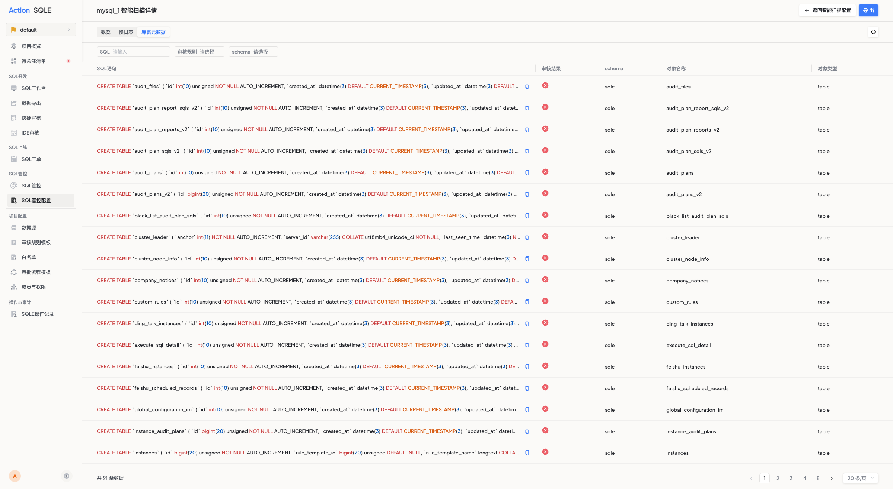

# 库表元数据

当您需要检查已上线业务对应数据源的建库建表语句是否符合统一的SQL质量规范，或需要定期检查上线业务的库表变更是否符合统一的SQL质量规范时，您可以对数据源开启库表扫描，获得SQL与审核建议。

### 支持的数据源类型
* MySQL
* DB2
* TDSQL
* PostgreSQL

### 前置条件
已添加对应数据源。

### 步骤一 开启库表扫描类型

在SQL管控配置中为数据源开启智能扫描，扫描类型选择“库表扫描”，并填写以下字段信息：

* 采集周期：指定SQLE每隔多久采一次SQL
* 是否采集视图信息：默认不采集视图信息，若开启，则将一并扫描数据源上的视图SQL；
* 审核规则模板：选择对应的审核规则模板；

点击`提交`，完成数据源上的库表SQL扫描任务配置。

### 步骤二 获取采集结果及审核结果
在扫描详情中查看采集的库表SQL信息及审核结果。

### 后续步骤
* 查看审核记录，查看不同时间点的审核结果，包括审核的SQL语句、审核结果。
* 分析语句，用户可对SQL语句进行分析操作，获取优化建议。
