# MyBatis 扫描

MyBatis 扫描用于在应用开发阶段对 MyBatis XML 文件中的 SQL 进行审核，尽早发现 SQL 质量问题。采集通过 SQLE 提供的 scannerd 工具完成，支持直接执行和 CI/CD 集成两种方式。

## 支持的数据源类型

所有平台已支持的数据源类型均支持 MyBatis 扫描。

## 前置条件

- 已在后端环境中准备好 MyBatis XML 文件

## 方式一：直接执行 scannerd

### 步骤一：创建扫描任务

进入智能扫描任务列表，点击 **新建**，选择 **MyBatis 扫描** 任务类型。

### 步骤二：执行 scannerd

:::tip
scannerd 通常位于 SQLE 安装目录的 `bin/` 下。使用 RPM 或 Docker 部署时路径相同。
:::

```bash
./scannerd mybatis \
  -H 10.186.64.175 \
  -P 10000 \
  -J default \
  -N mybatis1 \
  -D /tmp/xml \
  -A "<扫描任务凭证>"
```

| 参数 | 说明 |
|------|------|
| `-J, --project` | 扫描任务所在项目名称 |
| `-H, --host` | DMS/SQLE 主机地址 |
| `-P, --port` | SQLE 服务端口 |
| `-N, --name` | 扫描任务名称 |
| `-D, --dir` | MyBatis XML 文件所在目录 |
| `-A, --token` | 扫描任务凭证 Token，从平台页面复制 |

### 步骤三：查看审核结果

1. 进入扫描任务详情，查看已采集的 XML 文件中的 SQL
2. 点击 **立即审核**，在扫描报告中查看审核结果

## 方式二：在 CI/CD 平台集成

以腾讯云 CODING 为例，展示如何将 MyBatis 扫描集成到持续集成流程中。

### 步骤一：创建扫描任务

进入智能扫描任务列表，点击 **新建**，选择 **MyBatis 扫描** 任务类型。

### 步骤二：部署 CODING 平台

1. **创建项目**

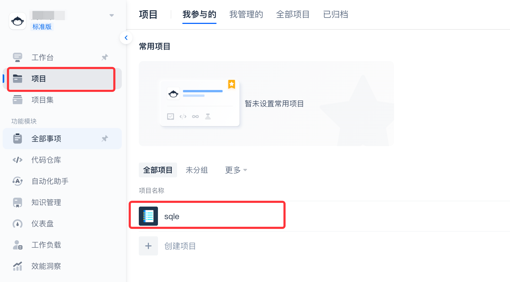

2. **创建代码仓库**（存放 XML 文件）

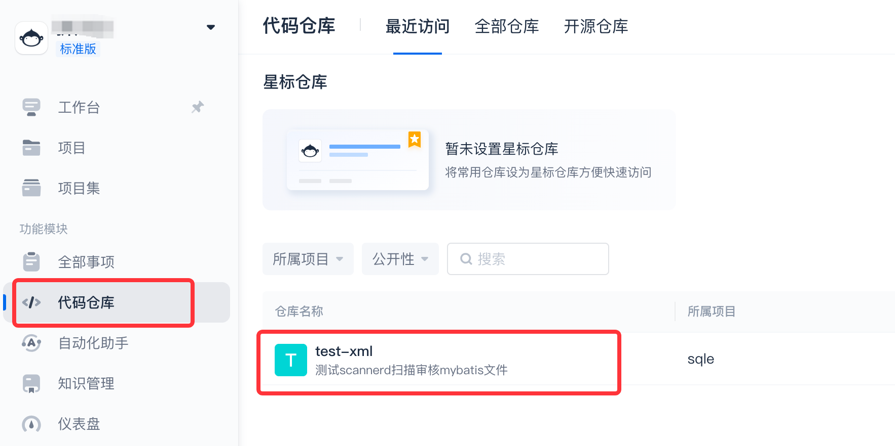
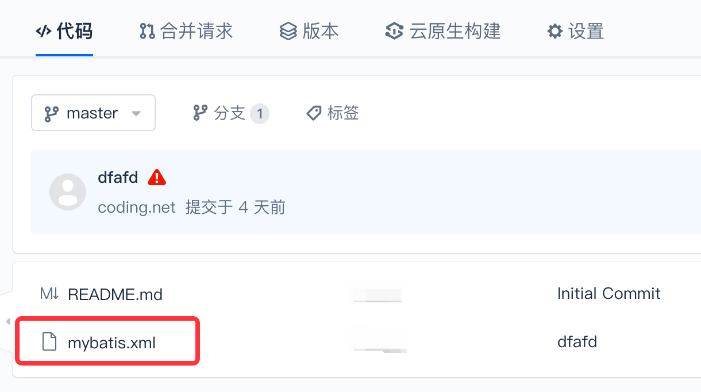

3. **上传 SQLE 插件**

进入 **团队设置中心** → **功能设置**：

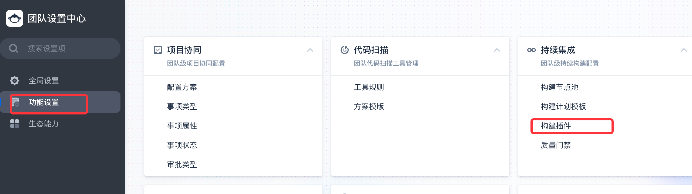

点击 **新建构建插件**，上传 `sqle-scannerd.zip` 并发布：

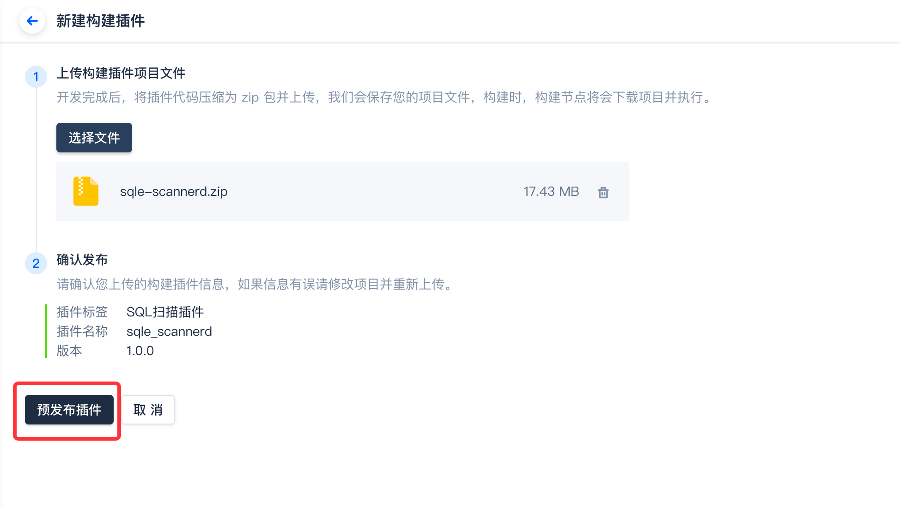

配置关联项目：

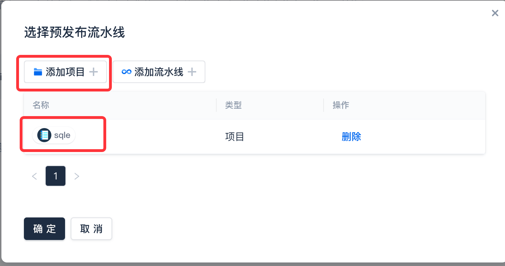

4. **创建构建计划**

进入项目 → **持续集成** → **构建计划**，点击 **创建构建计划**：

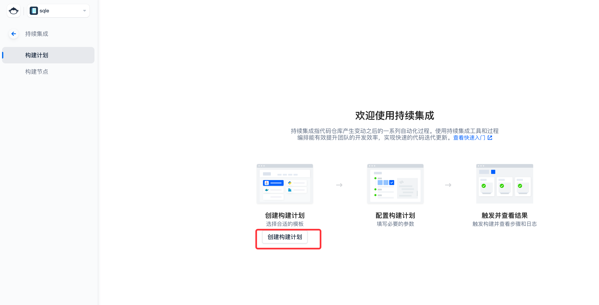

选择 **自定义构建过程** 模板：

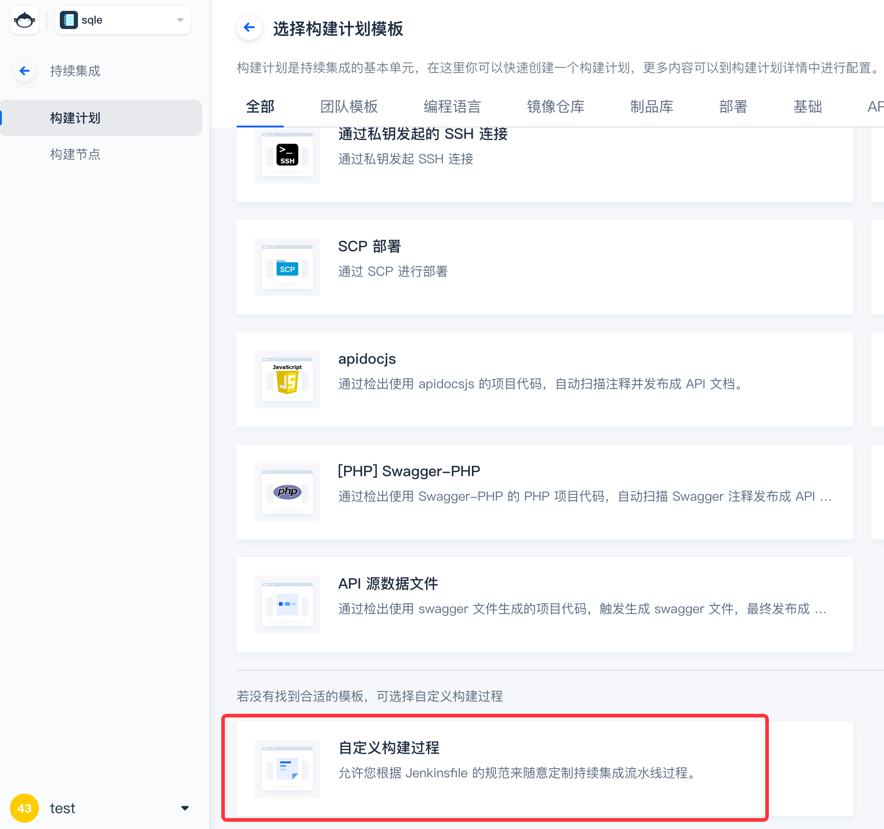

选择代码仓库：

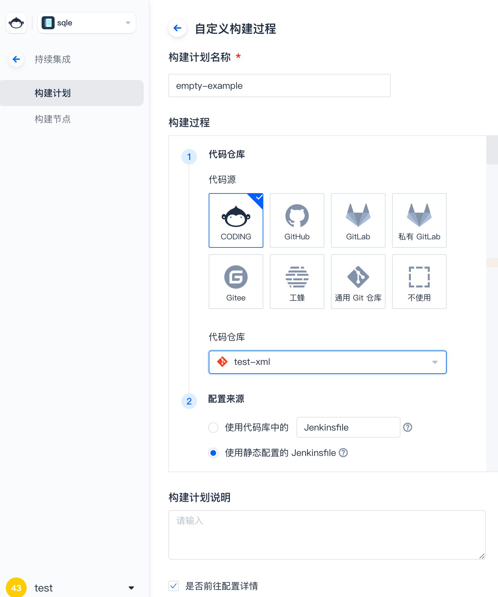

添加 SQL 审核节点：点击加号 → **其他** → **团队插件** → **SQL 扫描插件**：

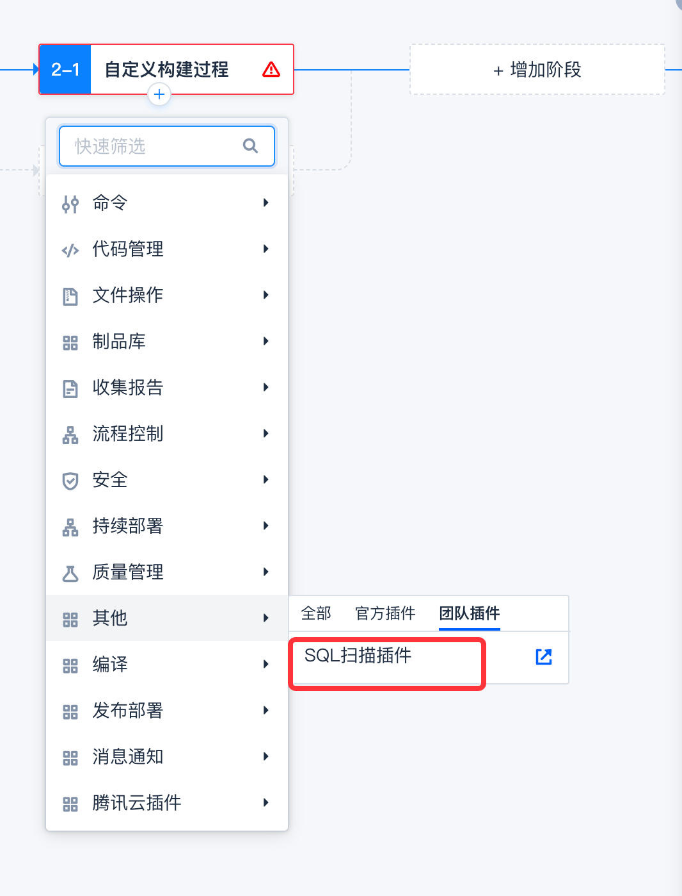

填写 SQLE 参数：

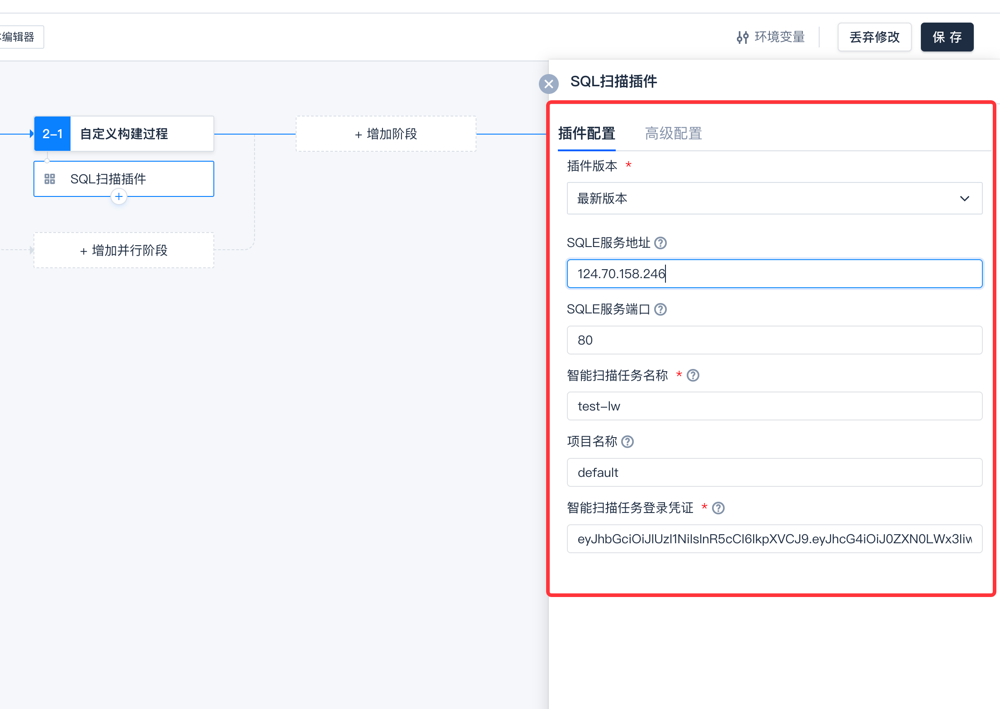

点击 **保存** 完成构建计划配置。

### 步骤三：触发构建

在构建计划中点击 **立即构建**：

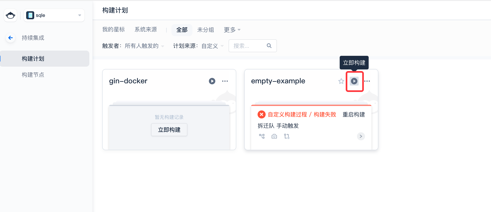

可在构建过程中查看结果，也可在 SQLE 平台的扫描任务中查看审核结果：

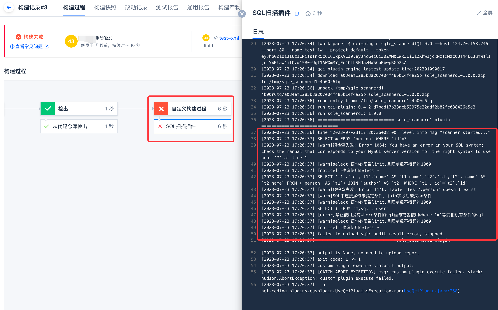
