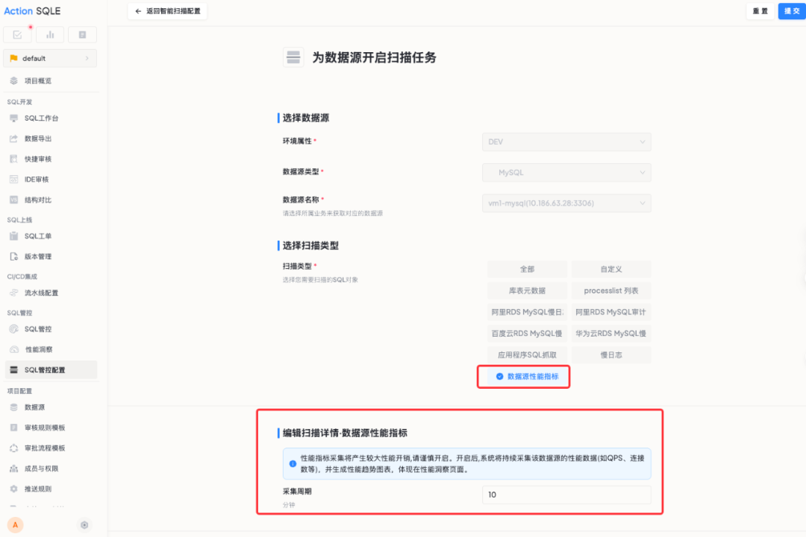
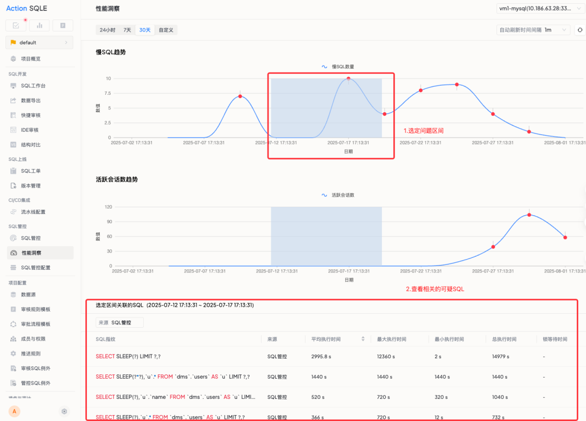

# 性能洞察

## 功能概述

### 功能用途

性能洞察是数据库的专属"听诊器"和"CT扫描仪"，通过数据库性能的全景视图，帮助用户直观地发现并定位数据库性能问题的根源。

### 应用场景

- 收到数据库 QPS（每秒查询率）下降的告警，却不知从何查起。
- 看到应用连接池持续走高，想知道是哪些操作占用了宝贵的数据库连接。
- 常规的监控只能告诉你"出事了"，但要找到"为什么"，依然需要登录服务器、翻阅日志，过程繁琐又低效。

### 主要特点

- **一屏尽览**：实时掌握数据库 QPS 和连接数等核心性能指标。
- **关联透视**：将 SQL 追踪、TopSQL 分析与性能指标在同一时间轴上精确对齐。
- **时空回溯**：通过图表拖动选择时间区间，快速筛选关联 SQL。

### 预期效果

不再让数据库性能问题成为难以捉摸的"黑盒"，通过数据驱动的精准定位，实现全新的运维方式。

## 核心功能

### 一屏尽览：实时掌握数据库性能脉搏

性能洞察页面提供了每个数据源最核心的"生命体征"指标：**QPS（每秒查询率）** 和 **连接数**。无需进行任何复杂配置，就能在这块"主心电图"上，随时掌握数据库的整体负载和健康脉搏，第一时间发现异常波动。

### 关联透视：从性能波动到深层定位

借助 SQL 追踪、TopSQL 分析或 Processlist 快照等深度扫描任务与核心性能指标在同一时间轴上进行了精确对齐和关联呈现，你不再需要在多个页面之间来回切换、费力地人工比对时间戳。这种强大的视觉关联，能瞬间将查询思路从"猜测"升级为"定位"，直接锁定问题范围。

### 时空回溯：精准锁定问题SQL

看到图表上的任何可疑迹象？只需用鼠标在图表上轻轻拖动，选中那个时间区间，下方就会立刻筛选出在该时段内，由扫描任务捕获到的所有相关 SQL 列表。从发现现象到锁定元凶，只需一次拖动！

## 前置条件

- 已在「SQL管控配置」中为数据源开启相应的扫描任务（如慢SQL、TopSQL等）。
- 已开启数据源性能指标监控开关。

## 操作指南

### 配置数据源性能监控

1. 进入「SQL管控配置」页面。
2. 为需要深入分析的数据源开启扫描任务。
3. 选择扫描类型，如"慢SQL"、"TopSQL"、"processlist列表"等。
4. 开启「数据源性能指标」开关，并设置采集周期。

### 使用性能洞察分析

1. 打开「性能洞察」页面，所有图表已为你聚合呈现。
2. 通过时间范围选择器（24小时、7天、30天、自定义）查看不同时间跨度的性能趋势。
3. 查看慢SQL趋势图，识别性能异常时间段。
4. 查看活跃会话数趋势，了解连接池使用情况。
5. 在图表上拖动鼠标选定问题区间，下方自动筛选出该时段相关的 SQL 列表。
6. 点击具体 SQL 进行进一步分析和优化。

## 注意事项

- 性能指标采集会产生较大性能开销，请谨慎开启。
- 开启后，系统将持续采集该数据源的性能数据（如 QPS、连接数等），并生成性能趋势图表，体现在性能洞察页面。
- 采集周期默认为 10 分钟，可根据实际需求调整。

