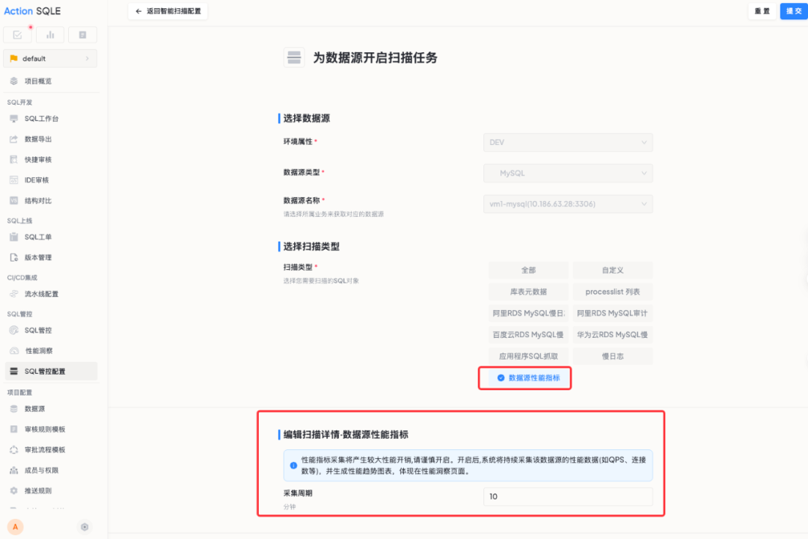
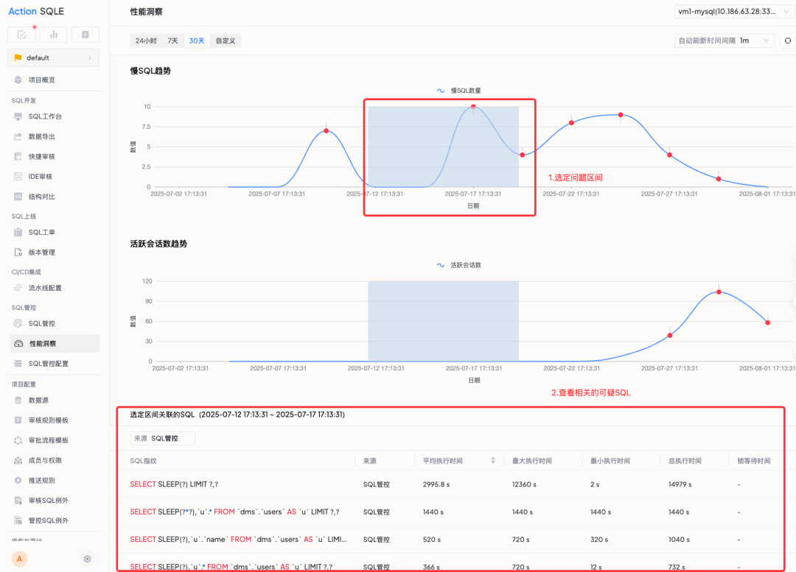

import Edition from '@site/src/components/Edition';

# 性能洞察 <Edition type="enterprise" />

性能洞察提供数据库性能的全景视图，通过实时监控 QPS 和连接数等核心指标，帮助用户发现并定位性能问题。

## 适用场景

- 数据库 QPS 下降或连接池持续走高，需要快速定位原因
- 需要将 SQL 追踪、TopSQL 分析与性能指标在同一时间轴上关联分析
- 需要回溯特定时间段内的数据库性能状况

## 核心功能

| 功能 | 说明 |
|------|------|
| 实时监控 | 掌握 QPS 和连接数等核心指标 |
| 关联透视 | SQL 追踪、TopSQL 与性能指标在同一时间轴对齐 |
| 时空回溯 | 在图表上拖动选择时间区间，自动筛选关联 SQL |

## 前置条件

- 在 SQL 管控配置中为数据源开启扫描任务（慢 SQL、TopSQL 等）
- 开启数据源性能指标监控开关

## 操作步骤

### 配置性能监控

1. 进入 **SQL 管控配置** 页面
2. 为目标数据源开启扫描任务
3. 开启 **数据源性能指标** 开关并设置采集周期

### 分析性能数据

1. 打开 **性能洞察** 页面
2. 通过时间范围选择器查看不同时间跨度的性能趋势
3. 在图表上拖动选定问题区间，下方自动筛选相关 SQL
4. 点击具体 SQL 进行深度分析

:::tip
性能指标采集会产生一定的性能开销，采集周期默认 10 分钟，可根据实际需求调整。
:::
