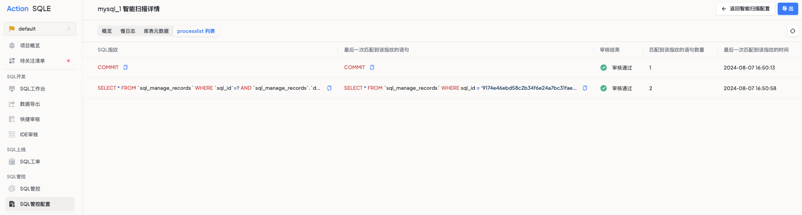

# 会话SQL扫描
本节介绍如何对MySQL进行中的会话SQL进行监督及审核。

### 支持的数据源类型
* MySQL

### 使用场景
除了上线前和上线后的审核，在SQL语句执行过程中，用户往往也需要对其进行监控和审核，用以及时识别出潜在的问题SQL。然而，当前的审核场景往往无法覆盖事中这一环节的审核。为此，DMS新增了processlist列表审核扫描任务，实现了事前、事中、事后的全覆盖，使得用户可以在SQL语句的整个生命周期内进行审核和管理，从而减少审核时间和工作量。

### 操作步骤
新建智能扫描任务

* 任务名称：输入审核任务名称，必须以字母开头；
* 数据源名称：指定扫描任务实施的数据源；
* 数据库：填写需要审核的目标库，若不填则仅进行静态分析不会连库；
* 数据库类型：根据选取的数据源呈现；
* 任务类型：选择需要执行的审核任务类型，选择processlist列表扫描任务；
* 采集周期（秒）：表示DMS对 MySQL processlist表的采集频率，DMS将按照该时间间隔进行SQL采集。如果该值过低，会影响实例性能；
* SQL最小执行时间（秒）：表示DMS对 MySQL processlist 的采集过滤条件，只有大于等于该时间的SQL才会被采集记录。如果为0，则表示不进行过滤；
* 审核过去时间段内抓取的SQL（分钟）：processlist列表扫描任务是增量审核，不在该时间段内执行的SQL将不会被再次采集；
* 审核规则模板：如果未指定此项会优先使用数据源绑定的模板；
* 任务审核周期：配置的是DMS对审核任务进行自动审核的执行时间；

### 执行结果
* 用户进入扫描任务详情，可以查看已采集到的processlist列表中的SQL信息；
* 用户点击`立即审核`，可以在扫描任务报告中获取processlist列表中当前采集周期内产生的SQL及审核结果；

