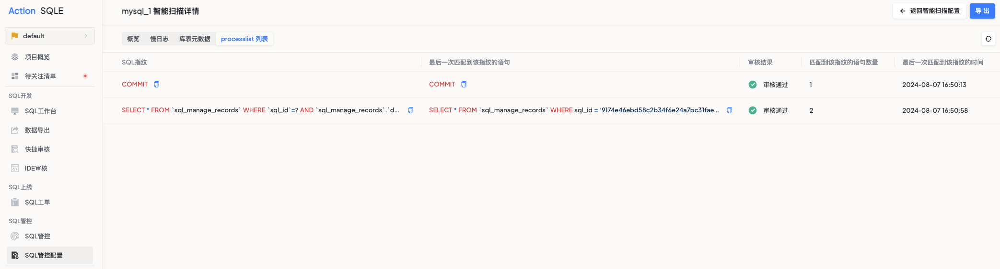

# 会话 SQL 扫描

会话 SQL 扫描通过定期采集 MySQL `processlist` 表中正在执行的 SQL，帮助监控查询性能、识别执行瓶颈和锁等待问题。

## 支持的数据源类型

- MySQL

## 前置条件

- 已在项目中添加目标数据源

## 操作步骤

### 步骤一：开启会话 SQL 扫描

1. 进入项目，点击左侧导航栏 **SQL 管控配置**
2. 找到目标数据源，开启智能扫描
3. 扫描类型选择 **会话 SQL 扫描**
4. 填写以下配置项：

| 配置项 | 说明 |
|--------|------|
| 采集周期 | SQLE 对 `processlist` 表的采集频率。设置过低可能影响实例性能 |
| SQL 最小执行时间（秒） | 仅采集执行时间大于等于该阈值的 SQL；设为 0 表示不过滤 |
| 审核规则模板 | 选择对应的审核规则模板 |

5. 点击 **提交** 完成配置

### 步骤二：查看采集与审核结果

在扫描详情中查看采集的会话 SQL 及审核结果。

