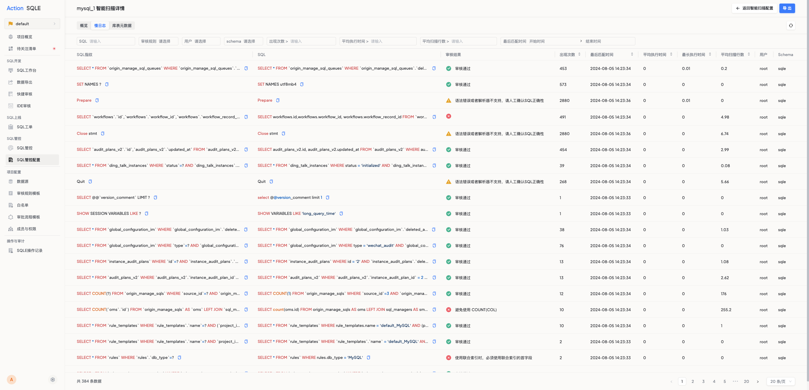

# 慢日志扫描

慢日志扫描用于采集数据源上超过指定时长的慢 SQL，帮助团队及时发现性能问题。

SQLE 支持两种慢日志采集方式：

| 采集方式 | 说明 | 适用场景 |
|----------|------|---------|
| 从 `mysql.slow_log` 表采集 | SQLE 直接查询慢日志表 | 可直连数据源 |
| 从 `slow.log` 文件采集 | 通过 scannerd 工具读取慢日志文件 | 网络隔离或需采集本地文件 |

## 支持的数据源类型

- MySQL
- TDSQL

## 方式一：采集慢日志表

### 前置条件

- 已在项目中添加目标数据源
- 在 MySQL 中开启慢日志：

```sql
SET GLOBAL long_query_time = 1;
SET GLOBAL slow_query_log = 1;
SET GLOBAL log_output = 'FILE,TABLE';
```

:::tip
为优化查询性能，建议将 `mysql.slow_log` 表引擎改为 MyISAM 并添加索引：

```sql
ALTER TABLE mysql.slow_log ENGINE = MyISAM;
ALTER TABLE mysql.slow_log ADD INDEX idx_start_time (start_time);
```
:::

### 操作步骤

1. 进入项目，点击左侧导航栏 **SQL 管控配置**
2. 找到目标数据源，开启智能扫描
3. 扫描类型选择 **慢日志扫描**
4. 配置项：

| 配置项 | 说明 |
|--------|------|
| 采集来源 | 选择 **从 mysql.slow_log 表采集** |
| 审核规则模板 | 选择对应的审核规则模板 |

5. 点击 **提交** 完成配置
6. 在扫描详情中查看采集的慢 SQL 及审核结果



## 方式二：采集慢日志文件

### 前置条件

- 已在项目中添加目标数据源
- 修改 MySQL 配置文件 `my.cnf`，开启慢日志并指定文件路径：

```ini title="my.cnf"
slow_query_log = ON
slow_query_log_file = /var/lib/mysql/tmp_slow.log
long_query_time = 1
```

### 操作步骤

1. 进入项目，点击左侧导航栏 **SQL 管控配置**
2. 找到目标数据源，开启智能扫描
3. 扫描类型选择 **慢日志扫描**
4. 配置项：

| 配置项 | 说明 |
|--------|------|
| 采集来源 | 选择 **从 slow.log 文件采集** |
| 审核规则模板 | 选择对应的审核规则模板 |

5. 点击 **提交** 完成配置

### 执行 scannerd 采集

在数据源所在环境执行 scannerd 文件。

:::tip
scannerd 通常位于 SQLE 安装目录的 `bin/` 下，需将其部署到数据源环境执行。
:::

```bash
./scannerd mysql_slow_log \
  --project=default \
  --host=127.0.0.1 \
  --port=10000 \
  --audit_plan_id=1 \
  --token=<扫描任务凭证> \
  --log-file /var/lib/mysql/mysql-slow.log
```

| 参数 | 说明 |
|------|------|
| `--project` | 扫描任务所在项目名称 |
| `--host` | DMS/SQLE 主机地址 |
| `--port` | SQLE 服务端口 |
| `--token` | 扫描任务凭证 Token，从平台页面复制 |
| `--log-file` | 慢日志文件路径 |

在扫描详情中查看从慢日志文件中采集的 SQL 及审核结果。

## 后续操作

- **关注慢 SQL**：重点优化频繁出现的慢查询，改善系统响应速度
- **过滤不关心的 SQL**：在 `sqle.black_list_audit_plan_sqls` 表中添加需过滤的 SQL 片段，扫描结果将自动排除包含指定关键字的 SQL
