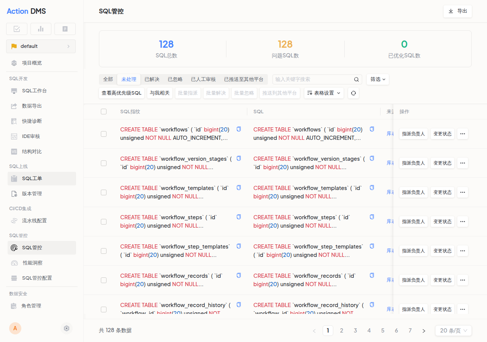

import Edition from '@site/src/components/Edition';

# SQL 管控列表 <Edition type="enterprise" />

SQL 管控列表集中展示来自 SQL 审核和智能扫描任务的所有 SQL。当 SQL 来源多且分散时，管控列表帮助团队快速发现问题 SQL、分配处理任务、追溯问题产生与解决过程。

## 前置条件

满足以下条件之一即可在管控列表中查看 SQL：

- 使用 SQL 快捷审核时为 SQL 添加了审核标签
- 在 SQL 管控配置中为数据源开启了智能扫描任务并获得采集结果

## 功能入口

进入项目后，点击左侧导航栏 **SQL 管控**。

## 筛选条件

| 筛选项 | 说明 |
|--------|------|
| SQL 来源 | 按来源方式筛选（SQL 审核、扫描任务等） |
| 数据源 | 按数据源筛选 |
| Schema | 按数据库 Schema 筛选 |
| 审核规则等级 | 按等级筛选，详见下方审核等级说明 |
| 时间范围 | 按 SQL 生成时间筛选 |
| SQL 状态 | 待处理、已解决、已忽略等 |
| 端点信息 | 按 SQL 来源端点筛选 |
| 与我相关 | 仅显示与当前用户相关的 SQL |
| 高优先级 SQL | 仅显示符合高优先级标准的 SQL |

## SQL 操作

### 数据查看

| 操作 | 说明 |
|------|------|
| 按指纹查看 | 按 SQL 指纹聚合，查看同结构 SQL 的审核列表 |
| 导出 | 按当前筛选条件导出管控列表数据 |
| 查看执行计划 | 分析 SQL 执行计划，定位性能瓶颈 |

### 状态变更

| 操作 | 说明 |
|------|------|
| 变更优先级 | 根据业务需求调整 SQL 的优先级 |
| 标记为已解决 | SQL 问题处理完毕后标记 |
| 标记为已忽略 | 非关键 SQL，避免干扰 |
| 标记为已人工审核 | 经过人工审核确认 |
| 添加为审核 SQL 例外 | 后续审核不再检查该 SQL |
| 添加为管控 SQL 例外 | 管控列表中不再显示该 SQL |

### 任务分配

| 操作 | 说明 |
|------|------|
| 指派负责人 | 将问题 SQL 分配给指定成员处理 |
| 推送到其他平台 | 将问题 SQL 同步到 Coding 等协作平台，实现跨平台协作 |

## 审核等级说明

平台审核规则按严重程度分为四个等级，影响 SQL 在管控列表中的优先级排序：

| 等级 | 标识 | 含义 | 建议处理方式 |
|------|------|------|-------------|
| Error | 🔴 错误 | 违反关键规范，可能导致数据安全或性能问题 | 必须修复 |
| Warn | 🟡 警告 | 存在潜在风险或不符合最佳实践 | 建议修复 |
| Notice | 🔵 提示 | 符合基本规范但有优化空间 | 酌情优化 |
| Normal | ⚪ 正常 | 审核通过，未触发任何规则 | 无需处理 |
