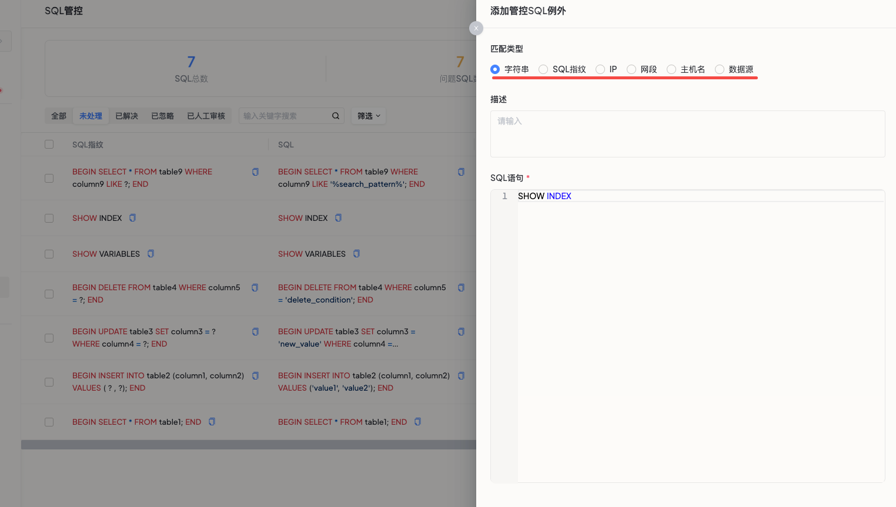

# 管控SQL例外`企业版`
在企业版中，管控SQL例外功能允许用户排除那些在SQL管控中不关键的语句，例如事务控制语句（BEGIN、END等），从而减少管控面板上的不必要干扰，让运维人员专注于识别和解决潜在性能瓶颈或风险点。

### 前置条件
用户采集到的SQL中包含无关或不关心的语句，影响用户在SQL管控列表中识别和解决潜在问题。

### 操作步骤

#### 访问管控SQL例外
* 项目管理员可以通过点击左侧导航栏的管控SQL例外菜单进入，也可以将不关注的SQL快速添加为管控SQL例外。

#### 添加管控SQL例外
* 点击列表右上角的`添加管控SQL例外`按钮。
* 选择匹配模式：
  * 按关键字匹配：精确匹配整个SQL查询，包括所有字符、空格和注释，不区分大小写。
  * 按SQL指纹匹配：通过分析SQL查询的结构特征生成唯一标识符（指纹），用于识别和比较查询。
  * 按IP匹配：匹配特定IP地址发起的SQL语句。
  * 按网段匹配：匹配特定网段内的SQL语句。
  * 按主机名匹配：匹配特定主机名的SQL语句。
  * 按数据源匹配：匹配特定数据源的SQL语句。
* 输入描述：提供该管控SQL例外的应用场景描述。
* 输入例外内容：输入需要排除的SQL语句或相关信息。

####  查看和执行
成功添加管控SQL例外后，您可以在当前项目中查看所有的项目管控SQL例外及其匹配模式。

SQL管控列表将不再出现对应的SQL。
