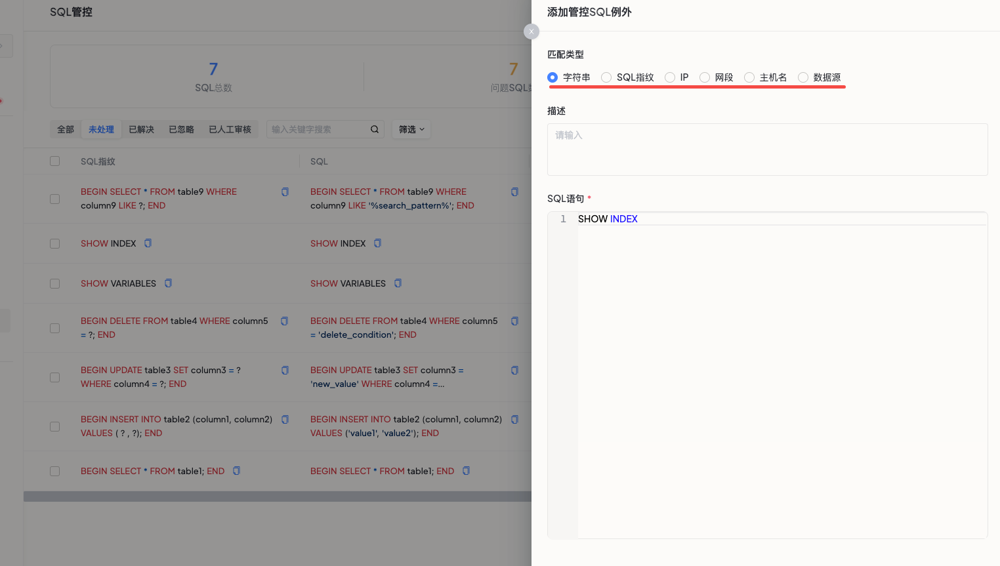

import Edition from '@site/src/components/Edition';

# 管控 SQL 例外 <Edition type="enterprise" />

管控 SQL 例外功能用于将无关或不需要关注的 SQL 从管控列表中排除，减少干扰，使运维人员聚焦于关键问题 SQL。

## 匹配方式

| 方式 | 说明 |
|------|------|
| 按关键字匹配 | 匹配含有指定关键字的 SQL，不区分大小写 |
| 按 SQL 指纹匹配 | 按结构特征匹配 |
| 按 IP 匹配 | 匹配特定 IP 地址发起的 SQL |
| 按网段匹配 | 匹配特定网段内的 SQL |
| 按主机名匹配 | 匹配特定主机名发起的 SQL |
| 按数据源匹配 | 匹配特定数据源上的 SQL |

## 操作步骤

### 添加管控 SQL 例外

1. 点击左侧导航栏 **管控 SQL 例外**
2. 点击 **添加管控 SQL 例外** 按钮
3. 选择匹配模式、输入描述和例外内容
4. 提交

添加后，管控列表将不再显示匹配到的 SQL。
