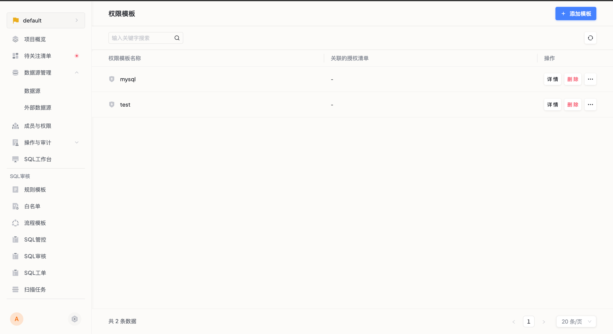

# 权限模板

权限模板支持灵活分组，按集合组织权限模板，以减少重复分配相同权限的工作量，提高权限管理效率。

### 使用场景
当需要对大量用户进行授权时，权限模板可以帮助您快速批量分配相同的权限。您只需创建一个权限模板，在模板中组合不同数据源的数据操作权限，然后将该模板应用于所需的用户。这样可以节省大量手动分配权限的时间和工作量。

### 前置条件
* 已添加数据源

### 操作步骤
**步骤一：进入权限模板列表，点击添加模板**

**步骤二：填写模板名称**

**步骤三：填写模板数据权限**

   * 选择数据源对应的业务：必选，用以确定数据源的可选范围；
   * 选择该业务下可用的数据源：必选，用以限制可操作的数据源；
   * 选择数据源下的库和表：非必选，如果不选，则对整个数据源的所有库表均有权限；
   * 选择该数据源上可用的数据操作权限：非必选，如果不选，则对整个数据库的所有数据表均有权限；

点击保存后，可以继续向权限模板中添加数据权限，或完成当前权限模板配置。

### 执行结果

### 更多操作

* 授权：指定拥有该模板权限的用户及数据库操作账号；
* 类似创建：克隆当前规则模板；