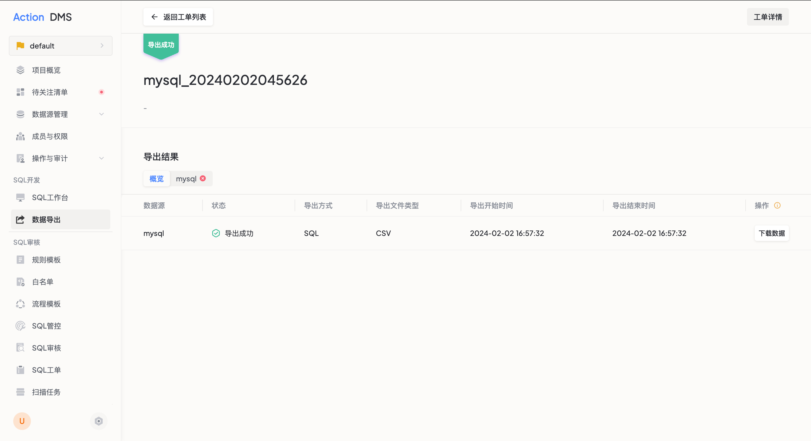
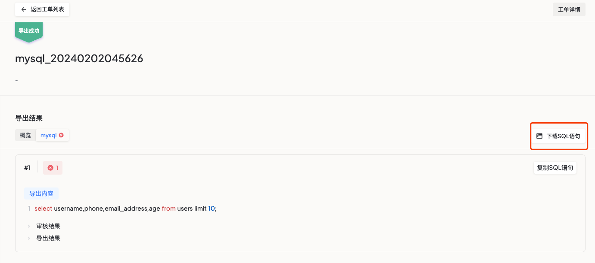

数据导出功能允许用户通过审批流程安全地获取数据库中的数据。平台记录导出人员、导出目的和导出内容，确保数据访问可审计、可追溯。

## 支持的数据源类型

MySQL、PostgreSQL、Oracle、SQL Server

## 前置条件

- 当前用户拥有 **创建数据导出任务** 权限
- 项目中存在拥有 **审批/驳回数据导出工单** 权限的成员

## 操作步骤

### 步骤一：创建数据导出工单

进入项目后，点击左侧导航栏 **数据导出**，点击 **创建导出** 按钮。

| 配置项 | 说明 | 是否必填 |
|--------|------|---------|
| 工单名称 | 导出工单的名称 | 是 |
| 工单描述 | 填写导出原因和用途 | 是 |
| 数据源 | 选择有导出权限的数据源 | 是 |
| 数据库 | 选择需要导出的数据库 | 是 |
| 导出方式 | 导出 SQL 结果集，需填写查询 SQL | 是 |
| 导出格式 | 目前支持 CSV 格式 | 是 |

填写 SQL 后平台会自动审核，预检查通过后提交工单。

### 步骤二：审批导出工单

审批人在导出工单列表中查看待审核工单，进入详情页查看工单信息和预审核结果后：

- **通过**：工单创建人可执行导出操作
- **驳回**：填写驳回原因，工单返回至创建人

### 步骤三：执行导出并下载

审批通过后，工单创建人进入工单详情，点击 **执行导出**。导出成功后点击 **下载** 获取数据文件。

## 后续操作

导出完成后可进入工单详情下载 SQL 语句，用于线下审计。

