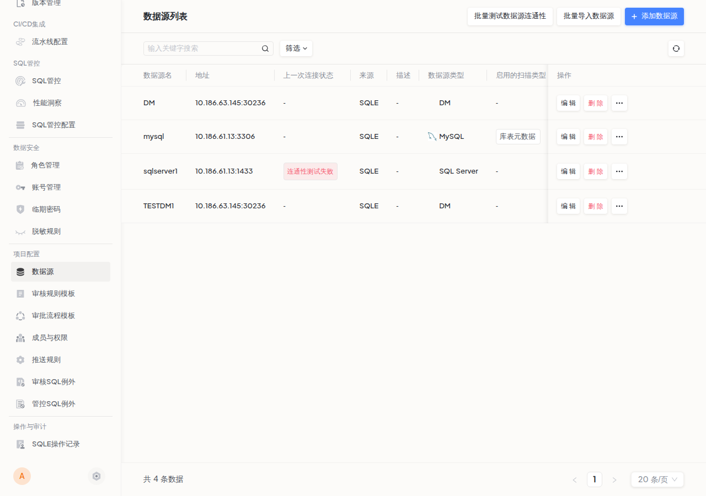
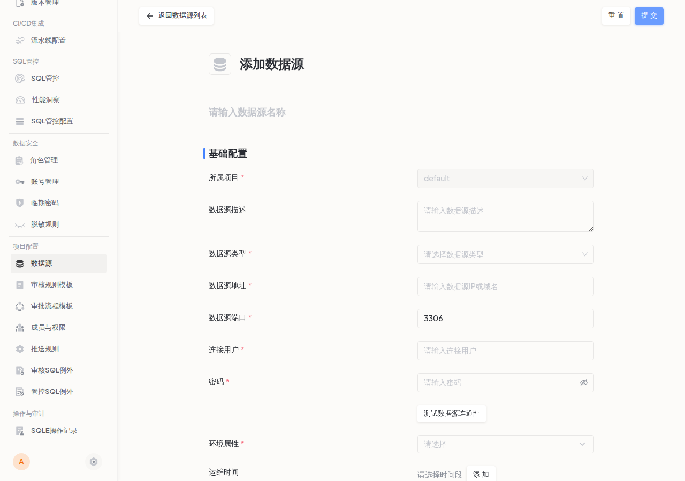
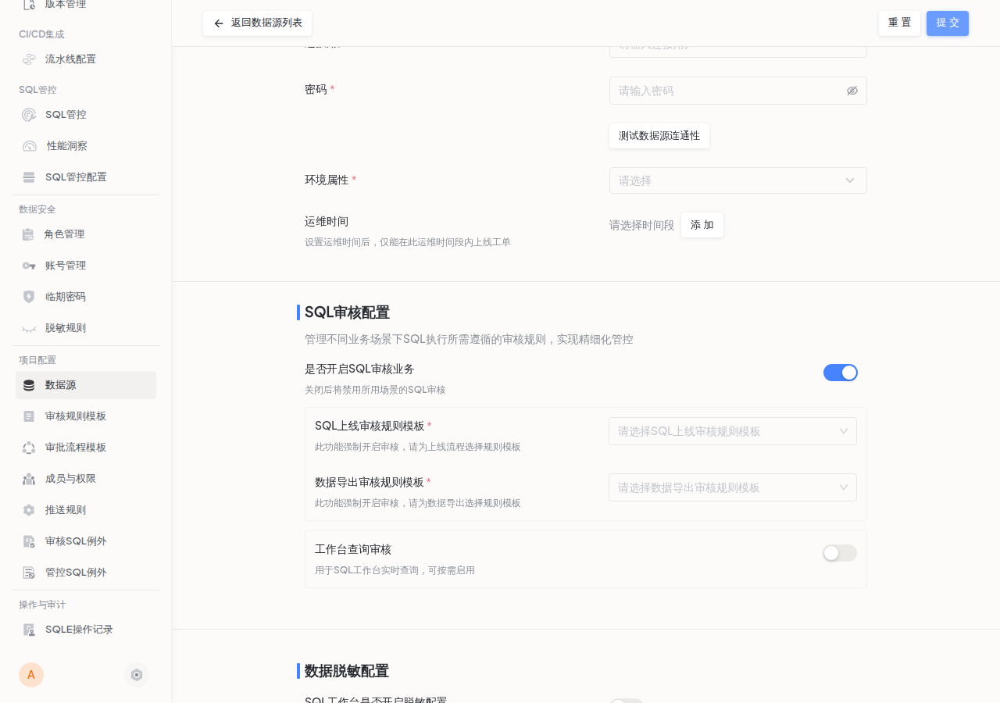
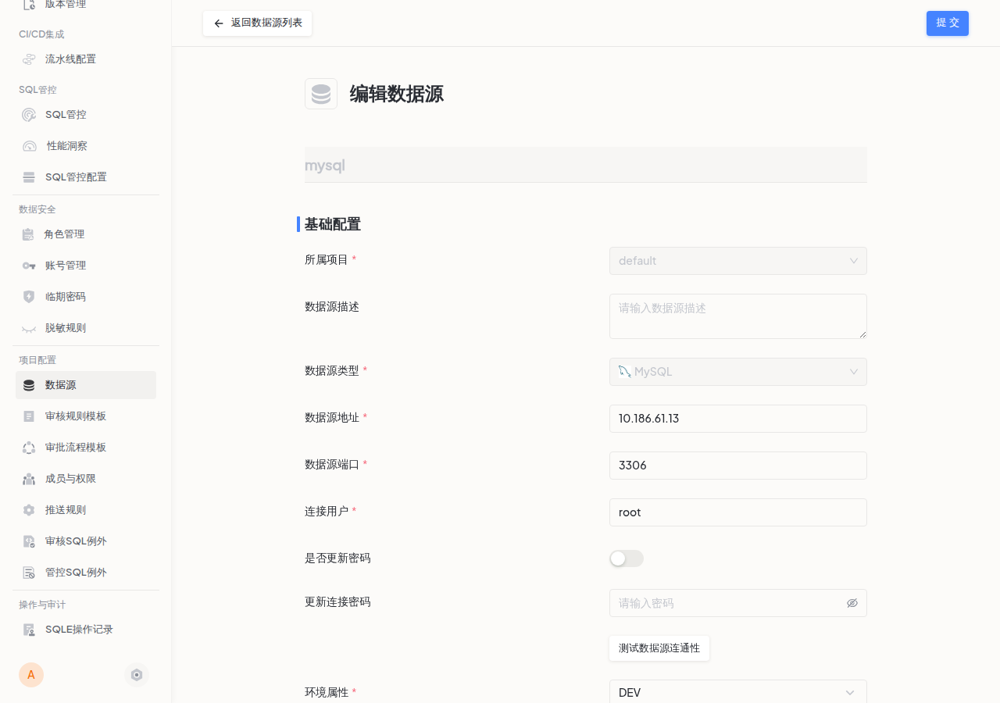

数据源是 SQLE 平台的核心资源。工单审核、智能扫描、SQL 工作台等功能均依赖数据源提供数据库连接。本文介绍如何在项目中添加、编辑和管理数据源。

## 前置条件

- 已创建项目（参见 [创建项目](project_create.md)）
- 当前用户为项目管理员或平台管理员
- 已准备好目标数据库的连接信息（地址、端口、用户名、密码）

## 数据源列表

进入项目后，点击左侧导航栏 **项目配置 → 数据源**，可查看当前项目下所有数据源。

列表展示以下信息：

| 列名 | 说明 |
|------|------|
| 数据源名 | 数据源名称，创建后不可修改 |
| 地址 | 数据库地址（IP:端口） |
| 上一次连接状态 | 最近一次连通性测试结果 |
| 数据源类型 | 数据库类型（MySQL、PostgreSQL、Oracle 等） |
| 启用的扫描类型 | 已启用的智能扫描任务类型 |
| 环境属性 | 环境标签（DEV / TEST / PROD 等） |
| 运维时间 | 运维时间窗口，仅在此时段内允许上线工单 |

列表顶部提供三个操作入口：

- **批量测试数据源连通性**：一键验证所有数据源的连接状态
- **批量导入数据源**：通过 CSV 文件批量导入数据源
- **添加数据源**：添加单个数据源

## 添加数据源

点击列表右上角 **添加数据源** 按钮，进入添加数据源页面。

### 基础配置

| 配置项 | 说明 | 是否必填 |
|--------|------|---------|
| 数据源名称 | 具有识别性的唯一名称，创建后不可修改 | 是 |
| 所属项目 | 所属项目，自动填充为当前项目 | 是（不可修改） |
| 数据源描述 | 补充说明信息 | 否 |
| 数据源类型 | 选择对应的数据库类型 | 是（创建后不可修改） |
| 数据源地址 | 数据库 IP 地址或域名 | 是 |
| 数据源端口 | 数据库端口号，根据数据库类型自动填充默认值 | 是 |
| 连接用户 | 具有所需操作权限的数据库用户 | 是 |
| 密码 | 连接用户的密码 | 是 |
| 环境属性 | 标记数据源所属环境（DEV / TEST / PROD 等） | 是 |
| 运维时间 | 运维时间窗口，设置后仅在此时段内允许上线工单 | 否 |

填写完成后，可点击 **测试数据源连通性** 验证连接信息是否正确。

:::tip
建议使用最小权限的专用账号连接数据源，避免使用 root 等高权限账号。连接用户至少需要对目标库的 SELECT 权限，若需要执行上线工单，还需要相应的写权限。
:::

### SQL 审核配置

审核配置决定了该数据源上各业务场景的 SQL 审核策略。

| 配置项 | 说明 | 默认值 |
|--------|------|--------|
| 是否开启 SQL 审核业务 | 总开关，关闭后禁用所有场景的 SQL 审核 | 开启 |
| SQL 上线审核规则模板 | 工单上线使用的审核规则模板，强制开启审核 | — |
| 数据导出审核规则模板 | 数据导出使用的审核规则模板，强制开启审核 | — |
| 工作台查询审核 | SQL 工作台实时查询的审核，可按需启用 | 关闭 |

:::tip
- 开启 **SQL 审核业务** 后，必须为工单上线和数据导出分别选择规则模板
- 开启 **工作台查询审核** 后，需额外配置审核规则模板和自动放行的最高审核等级（支持 normal / notice / warn / error 四级）
:::

### SQL 备份配置

| 配置项 | 说明 | 默认值 |
|--------|------|--------|
| 是否开启数据源上的 SQL 备份能力 | 开启后，该数据源上创建的工单将默认启用备份 | 关闭 |
| 回滚行数限制 | 当预计影响行数超过指定值时不执行回滚 | 1000 |

:::tip
SQL 备份功能仅对支持备份的数据库类型生效（如 MySQL）。开启后，工单执行时会自动创建备份，便于在执行出错时进行回滚。
:::

### 数据脱敏配置

:::caution DMS 专有功能
数据脱敏配置仅在 DMS 版本中可用。
:::

| 配置项 | 说明 | 默认值 |
|--------|------|--------|
| SQL 工作台是否开启脱敏配置 | 开启后，SQL 工作台的查询结果将按脱敏规则处理 | 关闭 |

开启脱敏后，可点击 **查看脱敏规则** 链接跳转到脱敏规则配置页面。

### 提交

确认所有配置后，点击页面右上角 **提交** 按钮完成添加。数据源添加成功后，可在数据源列表中查看。

## 编辑数据源

在数据源列表中点击目标数据源的 **编辑** 按钮，进入编辑页面。

编辑页面与添加页面结构一致，但以下字段创建后不可修改：

- 数据源名称
- 所属项目
- 数据源类型

密码字段默认隐藏，需要开启 **是否更新密码** 开关后才能修改。

## 删除数据源

在数据源列表中点击目标数据源的 **删除** 按钮。

:::caution
删除前请确认该数据源下没有未完成的工单。存在未完成工单的数据源无法删除。
:::

## 批量导入数据源

适用于平台初始化或需要大量添加数据源的场景。

1. 在数据源列表点击 **批量导入数据源** 按钮
2. 下载 CSV 导入模板
3. 按模板格式填写数据源信息（字段说明参见 [基础配置](#基础配置)）
4. 上传 CSV 文件，等待平台校验
5. 校验通过后确认导入

:::tip
如果导入文件存在问题，平台会提示校验失败并自动下载标注了错误信息的文件，可直接在文件中修改后重新上传。
:::

## 连通性测试

支持两种方式验证数据源连接：

- **单个测试**：在添加或编辑数据源页面中点击 **测试数据源连通性**
- **批量测试**：在数据源列表点击 **批量测试数据源连通性**，一次性验证所有数据源

测试结果会更新到列表的"上一次连接状态"列。

## 版本差异

:::note 社区版 vs 企业版
- **社区版**：仅支持一个默认项目，数据源在默认项目下管理
- **企业版**：支持多项目，每个项目独立管理数据源，支持批量导入
:::
