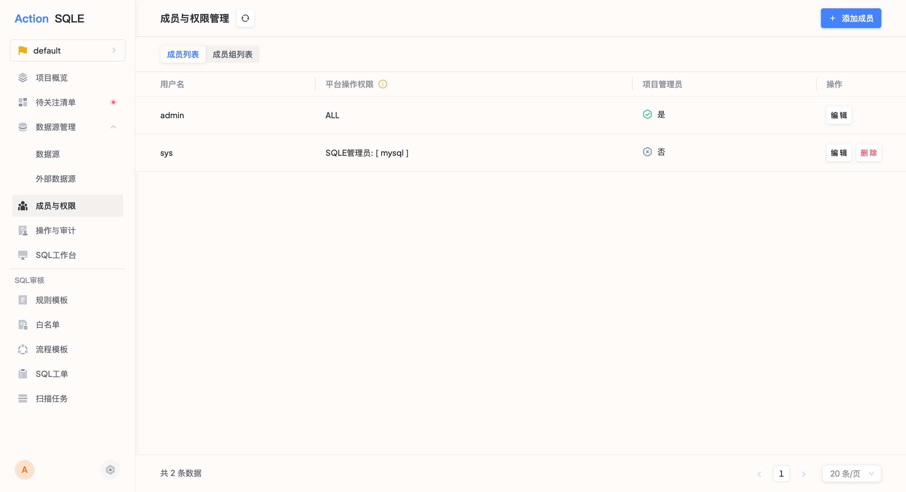
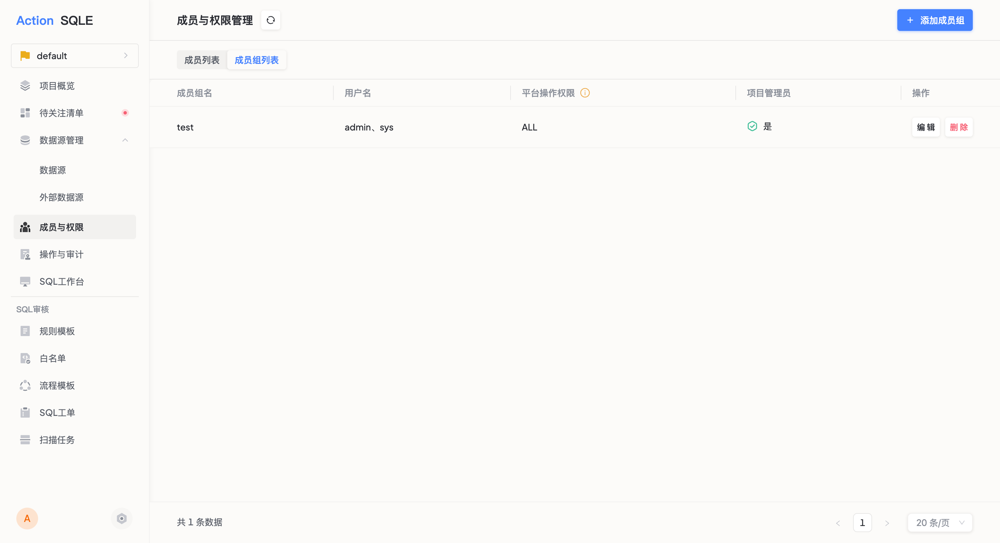

项目成员决定了谁可以访问和操作项目中的资源。只有被添加为项目成员的用户，才能查看和操作该项目内的数据源、工单、扫描任务等。

## 前置条件

- 当前用户为该项目的项目管理员
- 平台管理员已完成 [用户创建](../user-manager/user.md) 和 [角色配置](../user-manager/role.md)

## 成员管理

### 成员列表

进入项目后，点击左侧导航栏 **成员**，查看当前项目的成员列表。

列表展示每位成员的用户名、是否为项目管理员、绑定的角色与数据源等信息。

### 添加成员

点击 **添加成员** 按钮，填写以下信息：

| 配置项 | 说明 |
|--------|------|
| 用户名 | 从平台已有用户中选择 |
| 是否设为项目管理员 | 项目管理员拥有项目内所有资源的完整操作权限，无需额外绑定角色与数据源 |
| 角色与数据源绑定 | 非项目管理员需要通过此配置获得操作权限：选择可操作的数据源，并为其指定角色 |

:::tip
角色决定了成员在指定数据源上可执行的操作（如创建工单、审核工单、上线工单等）。平台默认提供 DEV 和 DBA 两种角色，也可自定义角色，参见 [角色管理](../user-manager/role.md)。
:::

### 编辑成员

点击成员列表中的 **编辑** 按钮，可修改成员的数据源与角色绑定关系。

修改仅对后续创建的工单生效，已有工单的权限不受影响。

### 删除成员

点击 **删除** 按钮移除成员。被删除的成员将无法再访问和操作项目内的资源。

## 成员组管理

当多个用户在项目内拥有相同的角色与数据源权限时，可以将他们组织为成员组，统一管理权限。

### 添加成员组

点击 **成员组** 标签，然后点击 **添加成员组** 按钮：

| 配置项 | 说明 |
|--------|------|
| 成员组名 | 成员组的名称 |
| 用户名 | 选择需要加入的用户（支持多选） |
| 是否设为项目管理员 | 与添加成员一致 |
| 角色与数据源绑定 | 与添加成员一致，组内所有成员共享同一权限配置 |

### 编辑与删除

与成员管理操作一致，编辑仅影响后续创建的工单。

## 权限分配示例

以下示例展示典型的项目成员配置方案：

### 场景：开发团队日常使用

| 成员 | 角色 | 绑定数据源 | 说明 |
|------|------|-----------|------|
| 项目负责人 A | 项目管理员 | — | 拥有项目内所有权限，无需绑定角色 |
| 开发人员 B | DEV | 测试库、预发库 | 可在绑定的数据源上创建工单、提交 SQL |
| 开发人员 C | DEV | 测试库 | 仅能操作测试库 |
| DBA D | DBA | 测试库、预发库、生产库 | 可审核工单、执行上线 |

### 配置步骤

1. **项目管理员 A**：添加成员时勾选「是否设为项目管理员」
2. **开发人员 B**：
   - 角色选择 `DEV`
   - 数据源绑定 `测试库` 和 `预发库`
3. **开发人员 C**：
   - 角色选择 `DEV`
   - 数据源绑定 `测试库`
4. **DBA D**：
   - 角色选择 `DBA`
   - 数据源绑定 `测试库`、`预发库`、`生产库`

:::tip
- 成员只能在绑定的数据源上执行对应角色允许的操作
- 如果需要同一用户在不同数据源上拥有不同角色，可添加多组角色-数据源绑定
- 批量管理时推荐使用成员组，避免逐个配置
:::

## 后续步骤

- [配置审批流程模板](workflow-template-manager.md) — 在流程模板中指定审核人和上线人时，可选择已添加的成员或成员组
