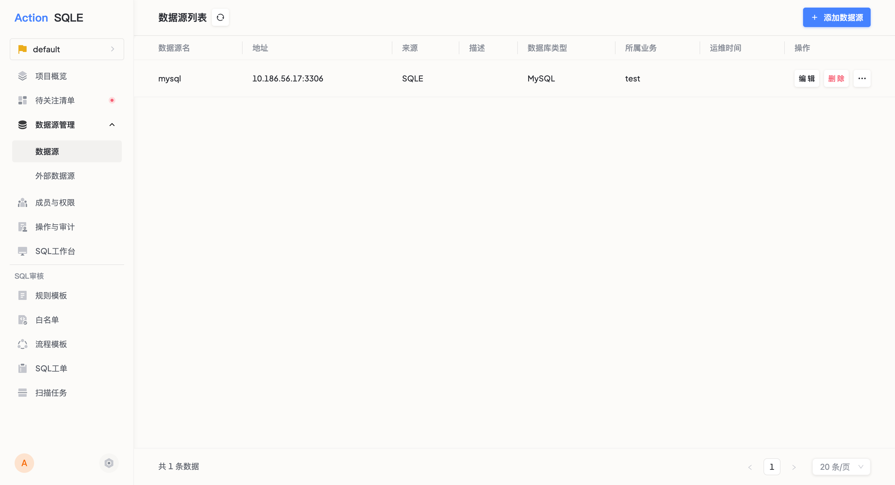

# 数据源管理

数据源管理是SQLE平台的核心功能之一，用于统一管理和维护各类数据库连接。它是工单处理和扫描任务的基础，为SQL审核和执行提供必要的连接信息。

### 适用对象
- 项目管理员：负责数据源的添加、配置和维护
- 数据库管理员：协助配置正确的连接信息

### 核心价值
- 集中化管理：统一管理所有数据库连接
- 安全性：统一的权限控制和审计
- 标准化：规范化的数据源配置和管理流程

### 添加单个数据源

#### 前置操作
项目管理员进入指定的项目

#### 添加数据源
1. 进入项目后，点击左侧导航栏的`数据源`菜单
2. 点击`添加数据源`按钮
3. 填写数据源信息

#### 操作步骤
点击左侧导航栏的`数据源`菜单，进入数据源管理页面后，点击`添加数据源`，填写数据源相关信息

##### 基础配置

| 配置项 | 说明 | 是否必填 | 示例 |
|--------|------|----------|------|
| 数据源名称 | 具有识别性的唯一名称 | 是 | prod-mysql-01 |
| 数据源描述 | 补充说明信息 | 否 | 生产环境主库 |
| 数据源类型 | 选择对应的数据库类型 | 是 | MySQL |
| 数据源地址 | IP地址或域名 | 是 | 127.0.0.1 |
| 数据源端口 | 默认将根据数据源类型自动填充 | 是 | 3306 |
| 连接用户 | 具有所需操作权限的用户 | 是 | sqle_user |
| 连接密码 | 连接用户的密码 | 是 | - |
| 环境属性 | 用于标记数据源的环境信息 | 是 | DEV |
| 运维时间 | 设置运维时间后，仅能在此运维时段内上线工单 | 否 | 23:00-06:00 |

##### SQL审核配置

管理不同业务场景下SQL执行所需遵循的审核规则，实现精细化管控。

| 配置项 | 说明 | 是否必填 | 示例 |
|--------|------|----------|------|
| 是否开启SQL审核业务 | 关闭后将禁用所有场景的SQL审核 | 否 | 开启 |
| SQL上线审核规则模板 | 此功能强制开启审核，请为上线流程选择规则模板 | 是 | default_MySQL_V1Rules |
| 数据导出审核规则模板 | 此功能强制开启审核，请为数据导出选择规则模板 | 是 | default_MySQL_V1Rules |
| 工作台查询审核 | 用于SQL工作台实时查询，可按需启用 | 否 | 开启 |
| 工作台查询审核规则模板 | 开启工作台查询审核后，需选择审核规则模板 | 是（开启工作台查询审核时） | default_MySQL_V1Rules |
| 自动放行的最高审核等级 | 低于或等于此等级的审核结果将自动放行 | 是（开启工作台查询审核时） | notice |
| 通过工单上线执行工作台非DQL类型SQL | 开启后，允许通过工单上线执行工作台非DQL类型的SQL语句 | 否 | 开启 |

:::tip
* 是否开启SQL审核业务：默认开启，关闭后将禁用所有场景的SQL审核功能；
* 工作台查询审核：默认关闭。开启该功能后，用户在SQL工作台中提交的SQL语句，将匹配所选审核规则模板进行实时审核；
* 自动放行的最高审核等级：支持四种审核等级：normal、notice、warn、error。低于或等于此等级的审核结果将自动放行，超过此等级的SQL语句将报错，不予执行；
* 通过工单上线执行工作台非DQL类型SQL：开启后，用户可在SQL工作台中通过创建工单的方式执行INSERT、UPDATE、DELETE等非DQL类型的SQL语句。
:::

##### SQL备份配置

| 配置项 | 说明 | 是否必填 | 示例 |
|--------|------|----------|------|
| 是否开启数据源上的SQL备份能力 | 开启后，数据源上创建的工单将默认开启备份能力 | 否 | 开启 |
| 回滚行数限制 | 当预计影响行数超过指定值则不回滚 | 是 | 1000 |

:::tip
* SQL备份能力：开启后，针对该数据源创建的工单将默认启用备份功能，便于在执行出错时进行回滚操作；
* 回滚行数限制：为防止大批量数据操作导致的性能问题，当预计影响行数超过指定阈值时，系统将不执行回滚操作。
:::

#### 执行结果
数据源添加成功后，可在数据源列表查看新增的数据源信息。

### 批量添加数据源
为提高平台初始化效率，用户可通过上传CSV文件，快速批量导入多个数据源，减少手动添加工作量。

#### 使用场景
* 平台初始化时需导入大量数据源。
* 定期批量更新或添加数据源。
* 多项目数据源的集中管理和批量操作。

#### 前置操作
* 项目管理员进入指定的项目。
* 项目管理员/平台管理员进入项目列表。

#### 操作步骤

1. 点击`批量导入数据源`按钮
2. 下载导入模板
3. 填写数据源信息，参考[添加单个数据源](#添加单个数据源)
4. 上传文件并等待验证
5. 确认导入

:::tip
导入后，SQLE平台将校验字段是否填写有误：
* 如导入文件没有问题，将在文件下方提示文件校验成功；
* 如导入文件有问题，将在文件下方提示文件校验失败，并自动下载标注了校验问题的文件，用户可以直接在文件中结合报错信息进行修改。
:::

## 管理功能
### 编辑数据源
* 可修改项：除数据源名称和类型外的所有信息 
* 生效时间：保存后立即生效

### 删除数据源
* 前置检查：系统将检查是否存在未完成的工单
* 删除限制：有未完成工单的数据源不可删除
* 影响范围：删除后相关的配置和历史记录将保留

### 连通性测试
* 测试内容：验证连接信息的正确性
* 执行时机：
  * 添加数据源时测试连通性/添加数据源后，验证数据源连接效果

## 最佳实践
### 安全配置
* 使用最小权限账号
* 定期更新连接密码
* 及时删除未使用的数据源

### 运维建议
* 配置合理的运维时间窗口
* 定期验证连通性
* 及时更新审核规则模板