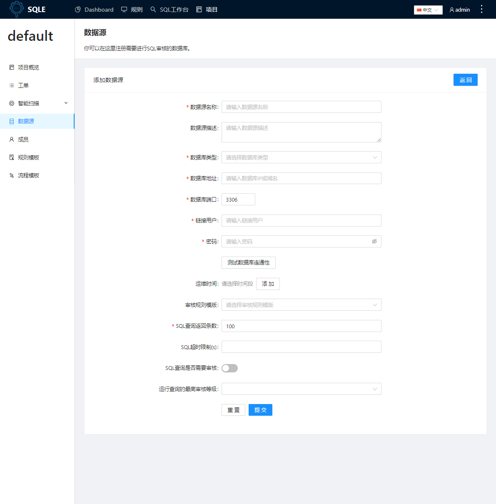
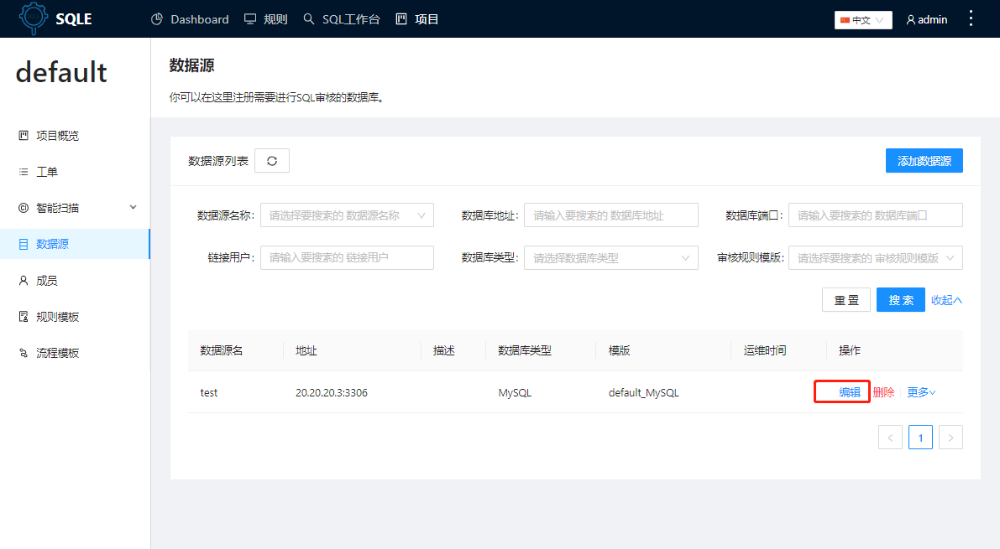

# 数据源
数据源管理是SQLE 提供的管理线上数据库的功能。一个数据源对应着一个数据库实例。

:::tip
数据源是SQLE连库审核的对象，任何审核的场景下若可以不选数据源则代表将进行脱库审核。
:::

## 添加数据源
进入项目，点击左侧导航栏的「数据源」标签，进入数据源管理页面

点击「添加数据源」，填写数据源相关信息

### 参数说明
|参数|说明|
|-|-|
|数据源名称|-|
|数据源描述|-|
|数据库类型|SQLE原生支持MySQL，其它类型的数据库的使用需要通过插件实现|
|数据库地址|数据库的host信息，支持录入IPV4、IPV6、域名|
|数据库端口|-|
|连接用户|连接数据库的用户|
|密码|连接数据库的用户的密码|
|运维时间（选填）|如果配置了运维时间，工单将只能在运维时间内上线(立即上线和定时上线都受此影响)，支持配置多个运维时间，默认无运维时间，即不限制上线时间|
|审核规则模板（选填）|数据源绑定的规则模版，作为数据源审核的默认模版，用于上线审核和智能扫描（若智能扫描未指定规则模版）|
|SQL查询是否要审核|选择是否要审核用户提交的sql查询，主要针对使用SQL工作台时的审核场景，参见：[SQL工作台](/docs/user-manual/sql-workbench/introduction.md)|
|运行查询的最高审核等级|若sql查询需要审核，设置用户查询sql时的审核等级，主要针对使用SQL工作台时的审核场景，参见：[SQL工作台](/docs/user-manual/sql-workbench/introduction.md)|

## 修改数据源
点击数据源列表页面的「编辑」按钮，可以修改指定数据源。可修改项与添加数据源时的要素一致，可参考上面的一节的说明。

## 删除数据源
点击数据源列表页面的「删除」按钮，可以删除指定数据源。
:::tip
若数据源上还有相应工单未完成，则该数据源暂时不可删除
:::
