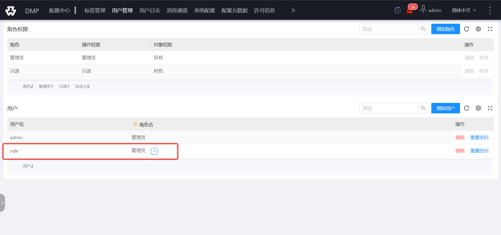
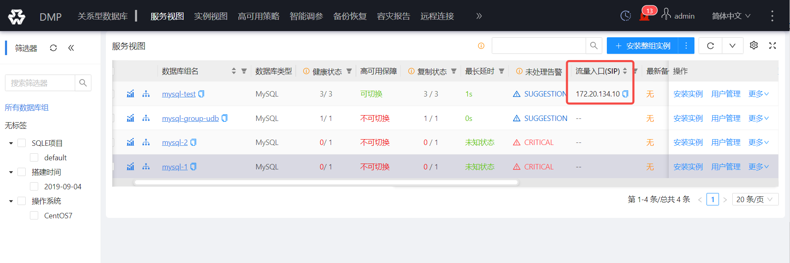
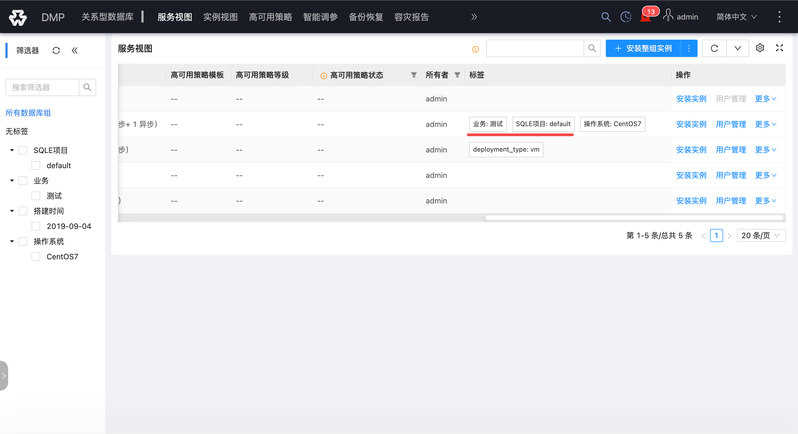
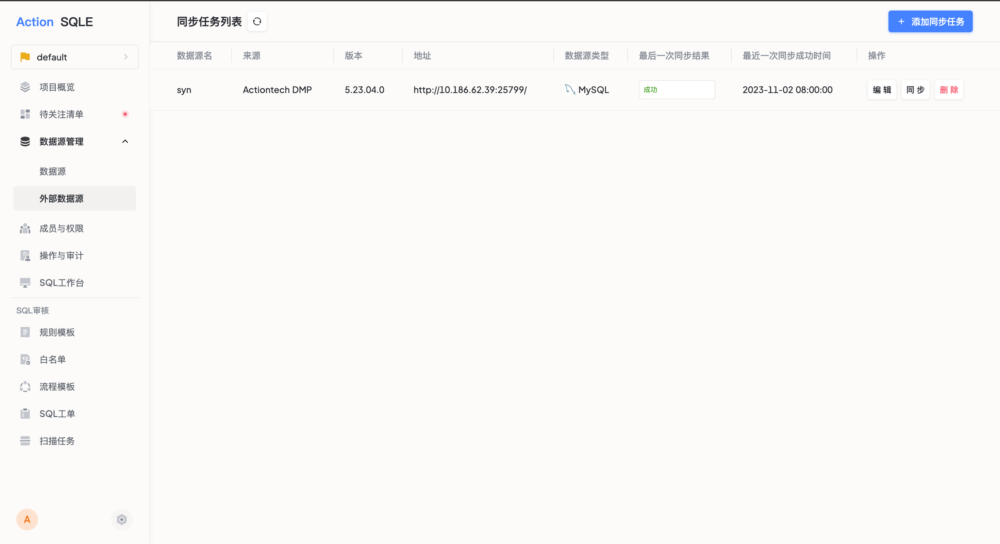
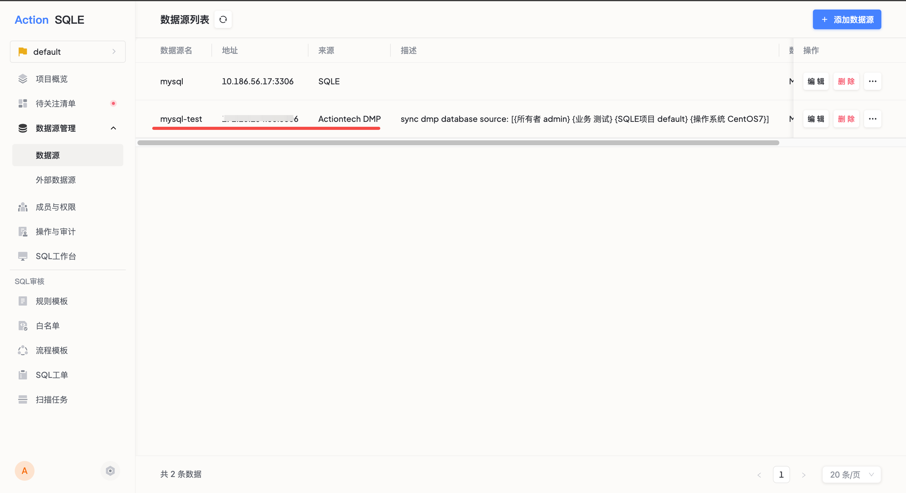

import Edition from '@site/src/components/Edition';

# 外部数据源同步 <Edition type="enterprise" />

SQLE 支持从外部平台导入数据源，避免在多个平台上重复添加。目前已实现对接爱可生商业产品「云树·DMP：数据库集群管理平台」。

:::tip
版本要求：仅支持 DMP 5.23.04.0 及以上版本。
:::

## 使用场景

当用户需要使用 SQLE 对其他平台上的数据源进行 SQL 管理时，只需在 SQLE 上创建同步任务，将外部平台的数据源同步至 SQLE，无需在两个平台上重复添加。

## 前置条件

在 DMP 平台上完成以下配置：

### 1. 添加同步用户

在 DMP 平台添加用户（如 `sqle`），并赋予管理员权限。

### 2. 为数据源组添加 SIP 流量入口

为需要同步的数据源组添加 SIP。SQLE 只会同步配置了 SIP 的数据源组。

### 3. 为数据源组添加项目标签

为需要同步的数据源组添加「业务」标签。SQLE 同步时将依据标签值，将数据源同步至对应项目并赋予指定业务属性。

## 操作步骤

1. 进入 SQLE 平台，展开 **数据源管理**，点击 **外部数据源同步**
2. 点击 **添加同步任务**，填写以下信息：

| 配置项 | 说明 |
|--------|------|
| 来源 | 目前仅支持 DMP 平台 |
| 地址 | DMP 平台地址，格式 `http://IP:端口` |
| 数据源类型 | 选择需要同步的数据源类型（如 MySQL） |
| 审核规则模板 | 选择同步后数据源使用的审核规则模板 |
| 同步间隔 | SQLE 按照设定的时间间隔自动执行同步 |

3. 点击 **提交**，SQLE 会立即执行一次数据源同步

## 同步结果

同步成功后，进入对应项目的数据源列表，可以看到 DMP 上配置了 SIP 的数据源组已添加到 SQLE 平台。

## 后续操作

- 管理员可编辑或删除同步任务
- 可在同步周期之外手动执行同步
- 同步后的数据源可直接用于创建工单或扫描任务
