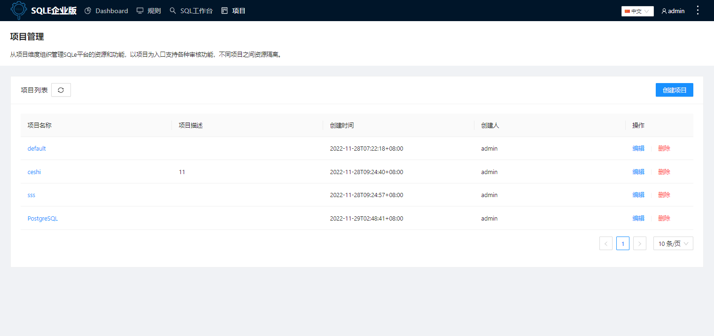

# 功能介绍
以项目为入口整合各种审核功能，并在不同项目之间实现资源、人员结构和流程隔离，使得SQLE在流程组织上更贴近具体的业务场景。

## 说明
:::tip
社区版仅支持一个默认项目，项目管理员是admin，企业版可创建多个项目，有创建项目权限的用户可以创建项目，创建项目后，可指定其他项目成员为项目管理员。
:::  

## 创建项目
进入项目管理页面，点击列表右上角“创建项目”按钮，输入项目名称及描述，提交后完成项目创建

### 示例
创建一个项目，名称为test1，描述为“test”，并提交

项目管理页面生成该条记录
