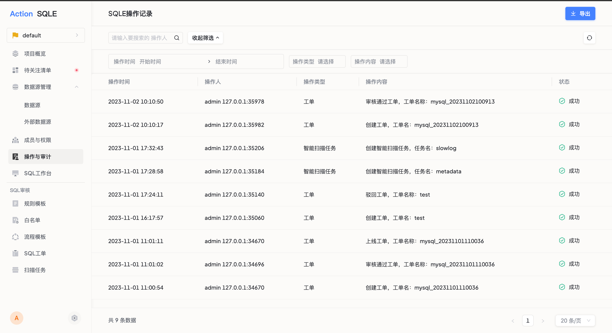

操作记录功能记录平台中所有关键操作的执行人和执行时间，用于行为审计和问题追溯。

## 功能入口

点击左侧导航栏 **操作与审计**，进入操作记录页面。

## 功能说明

| 功能 | 说明 |
|------|------|
| 查看记录 | 查看权限范围内可见的操作记录 |
| 筛选记录 | 按操作类型、操作人、时间范围等条件筛选 |
| 导出记录 | 导出满足筛选条件的操作记录，用于线下审计 |

## 记录保留

平台定时清理过期的操作记录，默认保留期为 90 天。如需修改保留时间，可在 [全局配置](../sys-configuration/configuration.md) 中调整。
