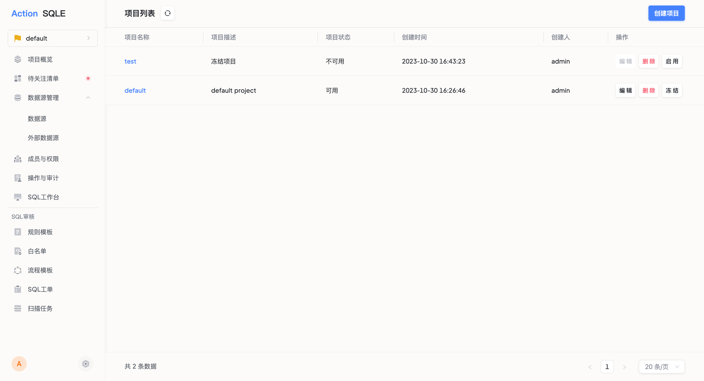

# 创建项目【企业版】

本文介绍如何在SQLE平台创建项目。
SQLE平台通过引入项目实现业务、资源的隔离，项目内创建的工单及扫描任务都将带有项目属性，仅项目成员可查看、操作。

### 使用场景
企业内容存在多个业务，且各个业务之间的数据源、工单、扫描任务可能由不同团队在负责，希望不同团队之间的数据相互隔离。此时，可在平台内以不同项目的行为去管理多个业务资源（数据源、工单、扫描任务等）。

### 前置条件
创建新项目时，需要用户拥有创建项目的权限，这部分内容可通过管理员账号配置，请参见平台用户管理，或由平台管理员直接创建项目。

### 操作步骤
拥有项目创建权限的用户/平台管理员点击页面顶部菜单栏【项目】，选择【查看所有项目】，点击列表右上角【创建项目】按钮

* 输入项目名称。如：actionsky
* 输入项目描述。如：处理爱可生项目的数据源、工单及扫描任务
* 点击提交

### 执行结果
项目创建完成后，可在项目列表中查看当前用户创建的项目。选中指定项目，可进入项目详情页面，查看并管理项目内的数据源、成员、审核规则模板、审核流程模板等内容。

:::tip
项目创建人在创建项目后会成为项目成员，承担项目管理员的身份，支持指定其他成员成为项目管理员，一个项目可对应多个项目管理员。
:::

### 后续步骤
项目创建后，用户在进行创建工单、创建扫描任务的核心业务之前，还需要做如下操作： 
* 初始化工单、扫描任务的实施对象即数据源，具体操作请参见[数据源管理](instance-manager.md)。
* 初始化工单、扫描任务的使用人员以及使用人员的操作权限即项目成员，具体操作请参见[成员管理](group_member.md)。
* 初始化工单、扫描任务的审核规则模板，一个项目内可为不同数据源定义不同的规则模板，具体操作请参见[规则模板管理](rule-template-manager.md)。
* 若存在无需审核的SQL，可在白名单管理中初始化白名单，请参见[白名单管理](whitelist-manager.md)；
初始化工单的项目审核流程模板，一个项目内所有工单共用一个审核流程，具体操作请参见[流程模板管理](workflow-template-manager.md)。

### 更多管理功能
项目管理包含编辑及删除操作。
* 项目编辑：项目创建人/平台管理员可在项目列表编辑项目条目信息，可编辑项为项目描述。
* 项目删除：项目创建人/平台管理员可在项目列表删除项目条目。
* 限制：删除项目前，需要确保项目下没有进行中的工单，才可成功删除。
* 影响：删除项目后，该项目下的数据源、工单及扫描任务信息都将被删除

