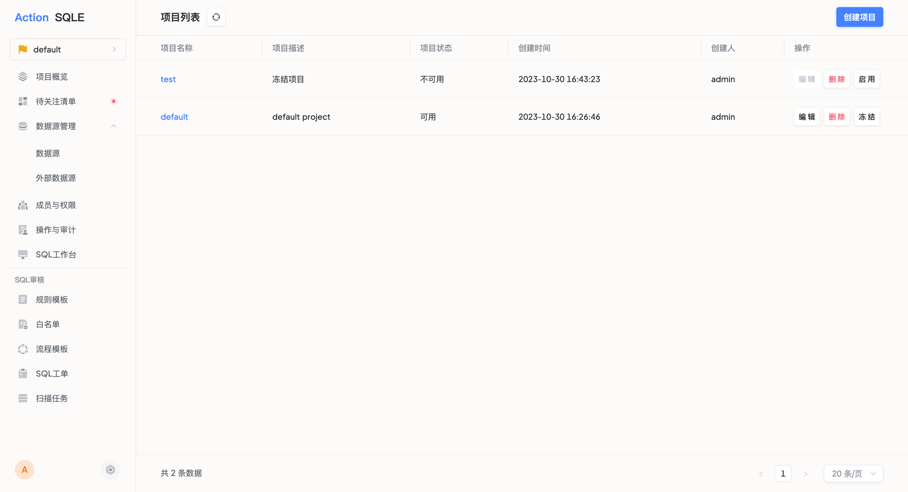

import Edition from '@site/src/components/Edition';

项目是 SQLE 中资源隔离的基本单位。每个项目独立管理数据源、成员、规则模板、流程模板、工单和扫描任务，不同项目间的资源互不可见。

:::note 社区版 vs 企业版
- **社区版**：系统预置一个默认项目，不支持创建额外项目，所有资源在默认项目中管理
- **企业版**：支持创建多个项目，按业务线、团队或环境灵活划分资源边界
:::

## 前置条件

- 当前用户为平台管理员，或拥有创建项目权限（参见 [用户管理](../user-manager/user.md)）

## 查看项目列表

点击顶部导航栏 **项目**，选择 **查看所有项目**，进入项目列表页面。

列表展示当前用户可见的所有项目，包括项目名称、描述、状态等信息。

## 创建项目 <Edition type="enterprise" />

在项目列表页面，点击右上角 **创建项目** 按钮。

| 配置项 | 说明 | 是否必填 |
|--------|------|---------|
| 项目名称 | 项目的唯一标识，创建后不可修改 | 是 |
| 项目描述 | 补充说明项目的用途、负责团队等信息 | 否 |

点击 **提交** 后项目创建完成。创建人自动成为该项目的项目管理员。

:::tip
一个项目可以有多个项目管理员。项目创建人可以在成员管理中指定其他成员为项目管理员。
:::

## 管理项目

在项目列表中，项目管理员或平台管理员可以对项目进行以下操作：

| 操作 | 说明 | 限制条件 |
|------|------|---------|
| 编辑 | 修改项目描述 | 项目名称不可修改 |
| 冻结 | 临时停用项目，项目内所有操作均不可执行 | 项目内不能有未完成的工单 |
| 启用 | 重新启用已冻结的项目 | — |
| 删除 | 永久删除项目及其所有资源 | 项目内不能有进行中的工单 |

:::caution
删除项目后，该项目下的数据源、工单、扫描任务等所有资源将被一并删除，且不可恢复。
:::

## 后续步骤

项目创建后，建议按以下顺序完成初始化配置：

1. [添加数据源](datasource.md) — 配置项目中需要管理的数据库
2. [添加成员](group_member.md) — 邀请团队成员并分配角色权限
3. [配置审核规则模板](rule-template-manager.md) — 为数据源绑定审核规则
4. [配置审批流程模板](workflow-template-manager.md) — 定义工单的审核与上线流程
