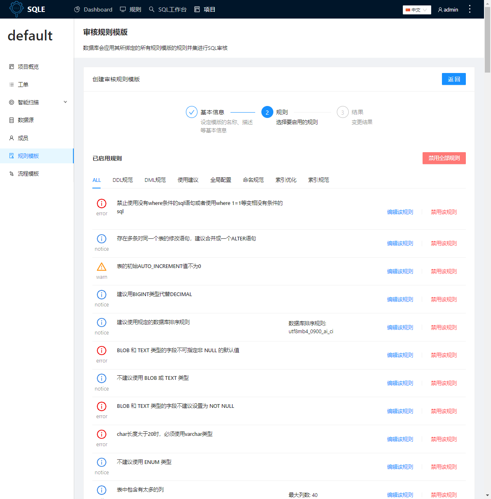
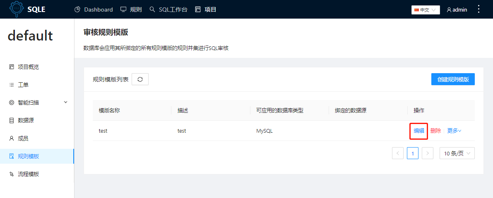
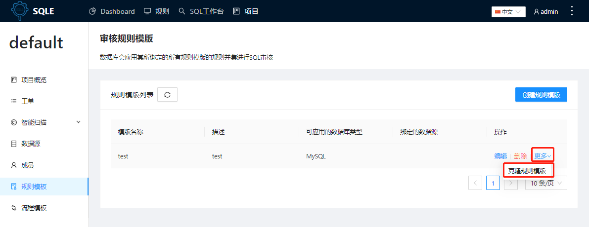

# 规则模版
规则模版是规则的集合，用户可以根据实际情况或者标准为不同的业务定制不同的规则模版。
:::tip
规则模版分为全局模版和项目模版，**全局模版**为超级管理员配置，所有项目都可见和使用；**项目模版**由超级管理员或者项目拥有者配置，仅在项目内使用
:::
:::tip
每个规则模版内可独立配置规则的级别和参数
:::

## 创建规则模板
在左侧导航栏的「规则模板」标签，查看当前项目中创建的审核模板

点击「创建规则模板」，填写规则模板相关信息

### 参数说明
|参数|说明|
|-|-|
|模板名称|-|
|模板描述|-|
|数据库类型|SQLE原生支持MySQL，其它类型的数据库的使用需要通过插件实现，选择数据库类型后可配置|

选择需要启用的规则，并根据需求修改规则的规则等级和规则值

点击「提交」，完成模板创建

## 编辑规则模板
点击规则模板列表中的「编辑」按钮，编辑规则模板内容，可编辑项与创建规则模板时的要素一致

## 删除规则模板
点击规则模板列表中的「删除」按钮，删除规则模板内容

## 克隆规则模板
点击规则模板列表中的「更多」按钮，在下拉菜单中选择「克隆规则模板」

填写克隆生成的模板名称及应用的数据源，需要注意同一个数据源仅能绑定一个规则模板
