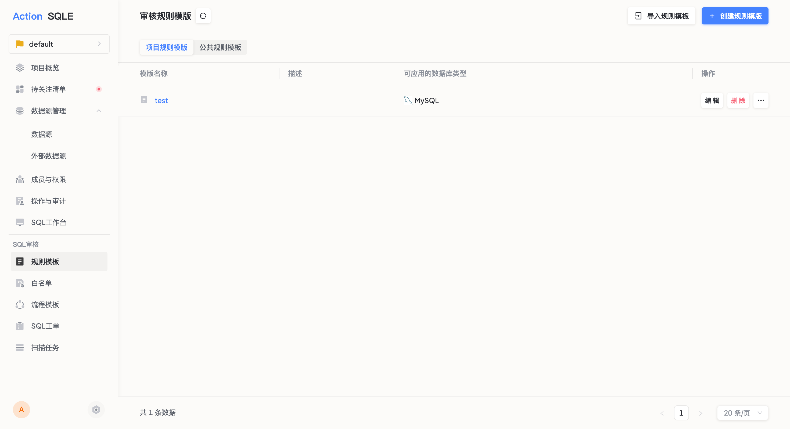

审核规则模板是一组审核规则的集合，用于定义 SQL 审核的标准。不同的数据源可以绑定不同的规则模板，以满足不同业务场景的审核需求。

## 模板分类

| 类型 | 管理者 | 可见范围 |
|------|--------|---------|
| 全局模板 | 平台管理员 | 所有项目均可引用 |
| 项目模板 | 项目管理员 | 仅在当前项目内可用 |

## 前置条件

- 当前用户为项目管理员或平台管理员
- 已进入目标项目

## 规则模板列表

点击左侧导航栏 **规则模板**，查看当前项目下的所有规则模板。

列表展示模板名称、对应的数据库类型、模板描述等信息。

## 创建规则模板

点击 **创建规则模板** 按钮，按以下步骤操作：

### 步骤一：填写基本信息

| 配置项 | 说明 | 是否必填 |
|--------|------|---------|
| 模板名称 | 以字母开头，只能包含字母、数字、中划线和下划线 | 是 |
| 模板描述 | 补充说明模板的适用场景 | 否 |
| 数据库类型 | 选择该模板适用的数据库类型（如 MySQL、PostgreSQL、Oracle 等） | 是 |

### 步骤二：配置审核规则

选择该模板中要启用的规则，并为每条规则设置：

- **规则开关**：启用或禁用该规则
- **告警等级**：普通（normal）、提示（notice）、警告（warn）、错误（error）
- **规则参数**：部分规则支持自定义参数阈值

:::tip
每条规则可以独立设置告警等级和参数值，方便根据团队规范进行精细化调整。
:::

### 步骤三：提交

确认配置后点击 **提交**，模板创建完成。

## 更多操作

| 操作 | 说明 |
|------|------|
| 编辑 | 修改模板的基本信息和规则配置 |
| 删除 | 删除模板（已被数据源绑定的模板不可删除） |
| 克隆 | 基于现有模板快速创建新模板，继承已启用的规则、等级和参数设置 |
| 导出 | 以 CSV 或 JSON 格式导出模板配置 |
| 导入 | 从 CSV 或 JSON 文件导入规则模板 |

## 后续步骤

- [数据源管理](datasource.md) — 在数据源的 SQL 审核配置中绑定规则模板
- [创建工单](workflow/create-workflow.md) — 工单审核将按数据源绑定的规则模板执行
- [SQL 管控配置](audit_task/intro.md) — 智能扫描任务也会引用规则模板
