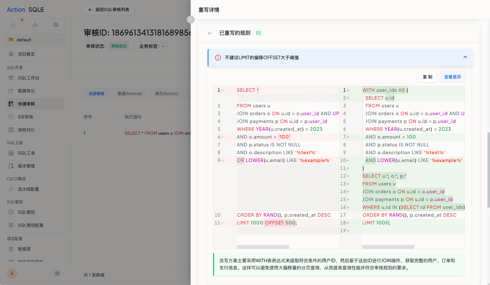

# SQL合规重写

## 功能概述
### 功能用途
SQL合规重写功能帮助用户快速将不合规的SQL语句转换为符合规范的SQL语句，避免因SQL不规范而被打回的情况。

### 应用场景
- 当您的SQL语句因不合规被打回需要修改时
- 当您理解问题原因，但对具体优化方案没有思路时
- 当您需要快速将SQL语句调整为符合规范的形式时

### 主要特点
- 一键重写：基于触发的审核规则自动提供重写方案，解放您的双手，告别反复修改；
- 对比清晰：清晰对照修改前后的SQL，使改动一目了然；
- 原理解读：每条规则都配备详细解释说明，边用边学；
- 风险提醒：自动提示重要变更，确保改写安全。

### 预期效果
通过简单的一键操作，您可以将不规范的SQL语句转换为符合标准的形式，提高开发效率，减少因SQL不规范导致的返工。

## 操作指南
### 功能入口位置
- 在SQL审核结果页面的操作列中，点击"SQL合规重写"按钮即可使用此功能。

### 操作步骤
1. 点击"SQL合规重写"按钮；
2. 系统自动分析并给出重写建议；
3. 查看对比说明，确认无误后一键应用。

## 注意事项
- 重写功能是基于您配置的审核规则进行的，建议您合理配置审核规则
- 系统会针对重要变更提供风险提醒，请仔细确认后再应用
- 重写后的SQL虽然符合通用的SQL审核，但您可能需要根据具体业务场景进行进一步优化

