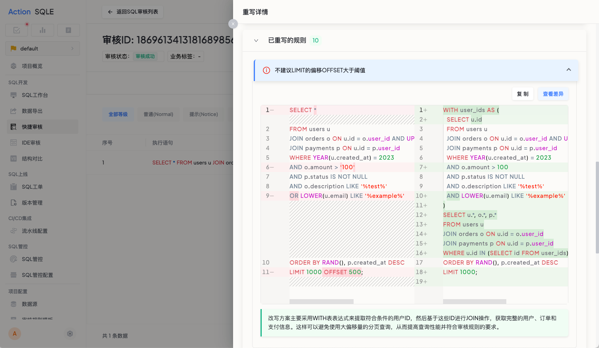

SQL 合规重写功能基于触发的审核规则，自动将不合规的 SQL 转换为符合规范的写法，减少因审核不通过导致的反复修改。

## 适用场景

- SQL 因不合规被工单审核打回，需要快速修改
- 了解问题原因但缺乏具体优化思路
- 需要将 SQL 快速调整为符合规范的形式

## 功能特点

| 特点 | 说明 |
|------|------|
| 一键重写 | 基于审核规则自动提供重写方案 |
| 对比清晰 | 修改前后 SQL 对照展示 |
| 原理解读 | 每条规则配备详细解释 |
| 风险提醒 | 自动提示重要变更 |

## 操作步骤

1. 在 SQL 审核结果页面的操作列中，点击 **SQL 合规重写** 按钮
2. 系统自动分析并给出重写建议
3. 查看对比说明，确认无误后一键应用

:::tip
- 重写基于配置的审核规则，建议合理配置审核规则以获得更好的重写效果
- 重写后的 SQL 符合通用审核规范，但可能需要根据业务场景进一步优化
:::
